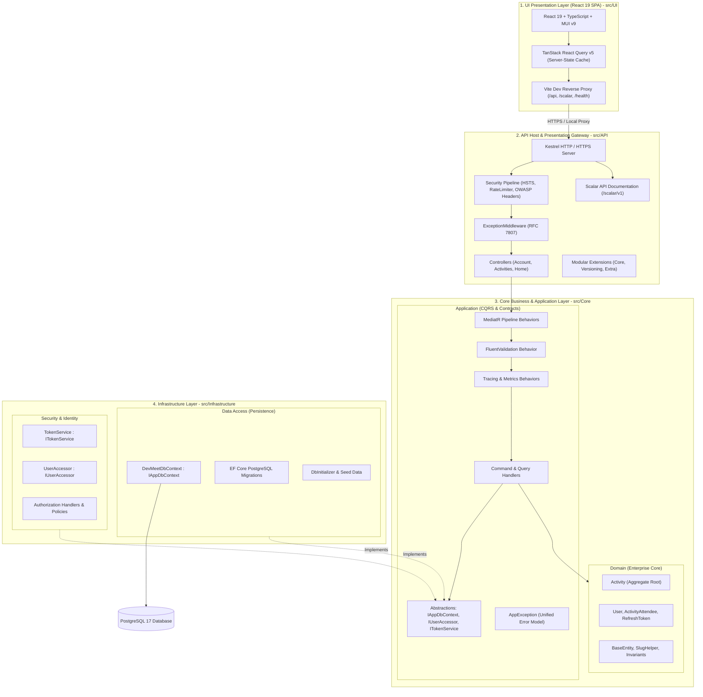
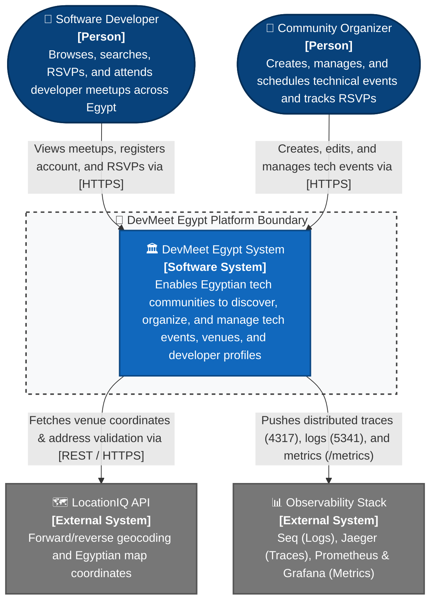
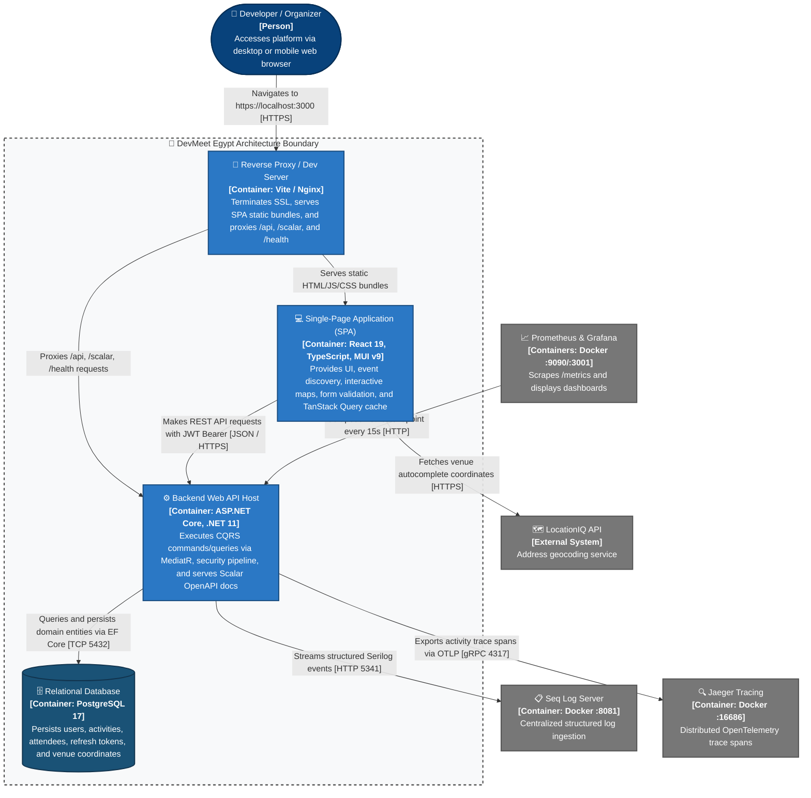
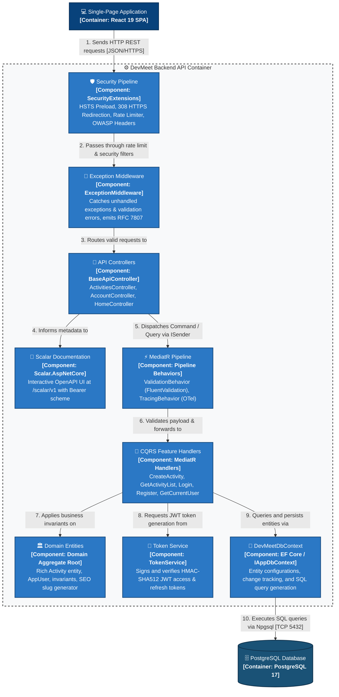
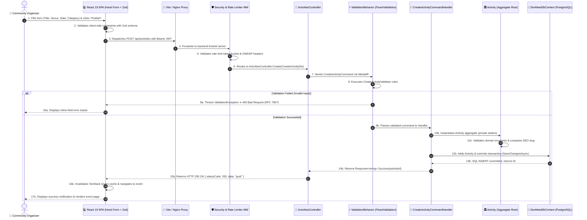
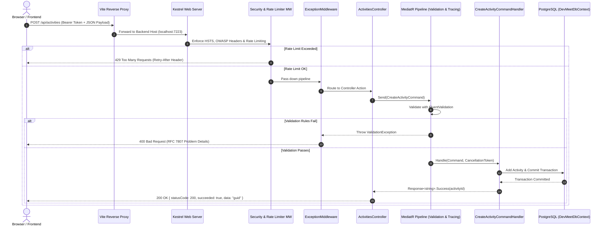
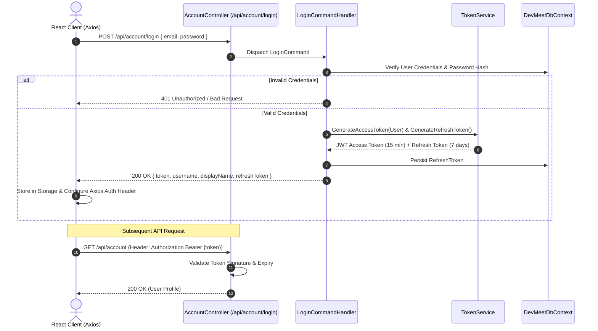

# 🏗️ Architecture Blueprint & Design Specification

> **Project:** DevMeet Egypt  
> **Engineering Level:** Senior Full-Stack Architecture  
> **Target Framework:** .NET 11.0 / ASP.NET Core & React 19 SPA  
> **Last Updated:** October 2026  

---

## 📑 Table of Contents

1. [Executive Summary & Core Tenets](#1-executive-summary--core-tenets)
2. [High-Level Architectural Topology](#2-high-level-architectural-topology)
3. [C4 Architecture Model](#3-c4-architecture-model)
   - [3.1 Level 1: System Context Diagram](#31-level-1-system-context-diagram)
   - [3.2 Level 2: Container Diagram](#32-level-2-container-diagram)
   - [3.3 Level 3: Component Diagram (Backend API Container)](#33-level-3-component-diagram-backend-api-container)
   - [3.4 Level 4: Dynamic Diagram (CQRS Event Creation Flow)](#34-level-4-dynamic-diagram-cqrs-event-creation-flow)
4. [Layer-by-Layer Detailed Breakdown](#4-layer-by-layer-detailed-breakdown)
   - [4.1 Core Layer — Domain & Application](#41-core-layer--domain--application-srccorecorecsproj)
   - [4.2 Infrastructure Layer — Data & Security](#42-infrastructure-layer--data--security-srcinfrastructureinfrastructurecsproj)
   - [4.3 API Layer — Host & Gateway](#43-api-layer--host--gateway-srcapiapicsproj)
   - [4.4 UI Layer — Frontend SPA](#44-ui-layer--frontend-spa-srcui)
   - [4.5 Testing Layer](#45-testing-layer-testcoretests)
5. [Request Processing & Pipeline Flow](#5-request-processing--pipeline-flow)
6. [Authentication & Authorization Lifecycle](#6-authentication--authorization-lifecycle)
7. [Cross-Cutting Concerns](#7-cross-cutting-concerns)
   - [7.1 Validation Pipeline (FluentValidation)](#71-validation-pipeline-fluentvalidation)
   - [7.2 Error Handling & RFC 7807 Problem Details](#72-error-handling--rfc-7807-problem-details)
   - [7.3 Telemetry & Distributed Tracing](#73-telemetry--distributed-tracing)
   - [7.4 Multi-Tier Defense-in-Depth Security](#74-multi-tier-defense-in-depth-security)
8. [Architectural Decision Records (ADRs)](#8-architectural-decision-records-adrs)

---

## 1. Executive Summary & Core Tenets

DevMeet Egypt is built as a modular monolith adhering strictly to the **Clean Architecture** (Onion Architecture) paradigm, complemented by **Domain-Driven Design (DDD)** tactical patterns, **Command Query Responsibility Segregation (CQRS)** via MediatR, and a modern **React 19 Single Page Application**.

### Guiding Architectural Principles

| Principle | Architectural Manifestation |
| :--- | :--- |
| **Dependency Inversion (DIP)** | The Domain and Application layers hold no direct references to outer infrastructure or data stores. Outer layers depend inward on abstractions. |
| **Separation of Concerns (SoC)** | Business rules, domain state transitions, data access, and HTTP concerns live in dedicated assemblies. |
| **CQRS Segregation** | Read operations (Queries) and write operations (Commands) are decoupled into dedicated models and handlers. |
| **Deterministic Result Pattern** | Handlers never throw exceptions for predictable flow control; they return standardized `Response<T>` payloads. |
| **Zero-Friction Dev Experience** | Vite dev server acts as a local reverse proxy, eliminating CORS and self-signed SSL certificate friction in local environments. |

---

## 2. High-Level Architectural Topology



---

## 3. C4 Architecture Model

The **C4 Model** (Context, Containers, Components, Dynamic) provides hierarchical architectural views of the system across four levels of abstraction, formatted with standard C4 notation and CSS color conventions.

---

### 3.1 Level 1: System Context Diagram

The System Context diagram establishes the boundary of the DevMeet Egypt platform, illustrating the human actors interacting with the system and external third-party software integrations.



---

### 3.2 Level 2: Container Diagram

The Container diagram zooms into the DevMeet Egypt boundary, showing the major deployable software containers, their technologies, and communication protocols.



---

### 3.3 Level 3: Component Diagram (Backend API Container)

The Component diagram dissects the **Backend Web API Container**, highlighting how Clean Architecture and CQRS slices assemble inside the ASP.NET Core host:



---

### 3.4 Level 4: Dynamic Diagram (CQRS Event Creation Flow)

The Dynamic diagram details the runtime collaboration between components during the creation of a new technical event:



---

## 4. Layer-by-Layer Detailed Breakdown

### 4.1 Core Layer — Domain & Application (`src/Core/Core.csproj`)

- **Assembly:** `Core.csproj`
- **Namespaces:** `Core.Domain`, `Core.Application`
- **Dependencies:** `MediatR`, `FluentValidation`, `AutoMapper`. (Zero dependencies on EF Core, ASP.NET Core, or Infrastructure).
- **Responsibilities:**
  - **Enterprise Domain:**
    - `Core.Domain.Common.BaseEntity`: Common audit and identity contract (`Id`, `CreatedAt`, `UpdatedAt`, `IsDeleted`).
    - `Activity` Aggregate Root: Rich model encapsulating invariants, state transitions, venue coordinates, and attendees with private setters.
    - Identity & Security Entities: `User` and `RefreshToken`.
    - Pure Helpers: `SlugHelper` generating deterministic URL slugs.
  - **Application CQRS & Orchestration:**
    - Vertical feature slices: `Activities` (Create, Edit, Delete, Details, List), `Account` (Login, Register, Refresh Token), `Home` (Dashboard metrics).
    - Pipeline Behaviors: `ValidationBehavior` (FluentValidation) and `TracingBehavior` (OpenTelemetry).
    - Contracts & Abstractions: `IAppDbContext`, `IUserAccessor`, `ITokenService`.
    - Unified Error Model: `AppException` and standardized `Response<T>` envelopes.

### 4.2 Infrastructure Layer — Data & Security (`src/Infrastructure/Infrastructure.csproj`)

- **Assembly:** `Infrastructure.csproj`
- **Namespaces:** `Infrastructure.Data`, `Infrastructure.Security`
- **Dependencies:** `Core.csproj`, `Npgsql.EntityFrameworkCore.PostgreSQL`, `Microsoft.AspNetCore.Identity.EntityFrameworkCore`, `Microsoft.AspNetCore.Authentication.JwtBearer`.
- **Responsibilities:**
  - **Persistence & Data Access (`Infrastructure.Data`):**
    - `DevMeetDbContext`: Implements `IAppDbContext` from Core with Fluent API configurations.
    - Automated Code-First PostgreSQL migrations and Egyptian tech community seed data.
  - **Security & Identity Adapters (`Infrastructure.Security`):**
    - `TokenService`: Issues HMAC-SHA512 JWT access tokens and cryptographically random refresh tokens.
    - `UserAccessor`: Reads authenticated `ClaimsPrincipal` from `IHttpContextAccessor`.
    - Authorization Handlers & Requirements (e.g., `IsHostRequirement`).

### 4.3 API Layer — Host & Gateway (`src/API/API.csproj`)

- **Assembly:** `API.csproj`
- **Namespaces:** `API`, `API.Controllers`, `API.Extensions`, `API.Configuration`, `API.Middleware`
- **Dependencies:** `Core.csproj`, `Infrastructure.csproj`, `Scalar.AspNetCore`, `Serilog.AspNetCore`, `Asp.Versioning.Mvc`.
- **Responsibilities:**
  - **Composition Root:** `Program.cs` orchestrates DI across `ModuleCoreDi`, `InfrastructureServicesRegistration`, and API extensions.
  - **Thin Controllers:** Validate HTTP parameters and route directly to MediatR `ISender`.
  - **Modular Architecture Extensions:**
    - `Core`: General framework and middleware wiring.
    - `Versioning`: URL / Header / Query API versioning with `Asp.Versioning`.
    - `Extra`: Scalar OpenAPI documentation, Serilog, and observability.
  - **RFC 7807 Error Pipeline:** `ExceptionMiddleware` translating exceptions and `AppException` to RFC 7807 problem details.

### 4.4 UI Layer — Frontend SPA (`src/UI/`)

- **Directory:** `src/UI/`
- **Tech Stack:** React 19, TypeScript, Vite, Material UI (MUI v9), TanStack Query v5, React Router.
- **Responsibilities:**
  - **Server-State Management:** TanStack Query handles caching, background invalidation, and optimistic mutations.
  - **Vite Reverse Proxy:** Forwards `/api`, `/scalar`, `/openapi`, and `/health` requests to backend Kestrel (`https://localhost:7223`), eliminating CORS and SSL friction.
  - **Form Validation:** React Hook Form with Zod schemas for instant feedback.

### 4.5 Testing Layer (`test/Core.Tests/`)

- **Assembly:** `Core.Tests.csproj`
- **Tech Stack:** xUnit, FluentAssertions, Moq.
- **Responsibilities:**
  - Unit tests for Domain entities and invariants (`BaseEntityTests`, `SlugHelperTests`).
  - Unit tests for CQRS handlers and validators.
  - Configuration and settings tests (`ApiSettingsTests`, `ApiConfigurationTests`).

---

## 5. Request Processing & Pipeline Flow

Every inbound HTTP request traverses a hardened middleware pipeline before reaching the CQRS handler:



---

## 6. Authentication & Authorization Lifecycle

DevMeet Egypt implements a stateless JWT authentication architecture combined with secure refresh tokens:



---

## 7. Cross-Cutting Concerns

### 7.1 Validation Pipeline (FluentValidation)
- Validators are declared next to commands in vertical slices (e.g., `CreateActivityValidator`).
- Executed automatically by `ValidationBehavior<TRequest, TResponse>`.
- Any validation failure throws a `ValidationException` containing property-level error lists, mapped directly to RFC 7807 responses.

### 7.2 Error Handling & RFC 7807 Problem Details
- Unhandled exceptions are intercepted centrally by [`ExceptionMiddleware.cs`](file:///c:/Users/ahmed/OneDrive/Desktop/FullStackDotNEtREACT/API/Middleware/ExceptionMiddleware.cs).
- Standardized error format:
  ```json
  {
    "type": "https://tools.ietf.org/html/rfc9110#section-15.5.1",
    "title": "One or more validation errors occurred.",
    "status": 400,
    "errors": {
      "Title": ["The Title field is required."]
    },
    "traceId": "00-805c882070a7895de57164f2d366c2f7-01"
  }
  ```

### 7.3 Telemetry & Distributed Tracing
- **OpenTelemetry SDK:** Instruments inbound ASP.NET Core requests, Entity Framework Core queries, and outbound HTTP client requests.
- **Exporters:**
  - **Jaeger (OTLP gRPC 4317):** Visual distributed traces for query bottleneck detection.
  - **Prometheus (Scraping `/metrics`):** Request rates, error rates, and duration histograms.
  - **Seq (OTLP HTTP 5341):** Structured centralized logging with Trace ID correlation.

### 7.4 Multi-Tier Defense-in-Depth Security
- **Strict HSTS:** `max-age=31536000; includeSubDomains; preload`.
- **Permanent HTTPS Redirection:** Upgrades insecure requests to HTTPS (308 Permanent Redirect).
- **Rate Limiting:**
  - Global Sliding Window: 100 req/min per IP.
  - Auth Fixed Window: 10 req/min for `/login` and `/register`.
- **OWASP Hardening Headers:** `nosniff`, `DENY`, `strict-origin-when-cross-origin`, `X-XSS-Protection`.

---

## 8. Architectural Decision Records (ADRs)

### ADR-001: 4-Layer Clean Architecture & CQRS Segregation

- **Context:** The application manages complex business invariants, diverse query shapes, and multiple integration points across backend and frontend.
- **Decision:** Adopt an enterprise 4-layer Clean Architecture organized under `src/` and `test/`:
  1. `src/Core`: Domain logic & Application CQRS (Domain + Application).
  2. `src/Infrastructure`: Persistence (EF Core, Migrations) & Security (JWT, Identity).
  3. `src/API`: Presentation host, modular configurations (Core, Versioning, Extra), and middlewares.
  4. `src/UI`: Modern React 19 SPA with Vite reverse proxy.
  5. `test/Core.Tests`: Automated unit and integration test suite.
- **Consequences:** Eliminates unnecessary project fragmentation while enforcing strict inward dependency boundaries, high cohesion, zero circular dependencies, and streamlined CI/CD pipeline builds.

### ADR-002: Scalar API Reference over Swagger UI
- **Context:** .NET 9+ deprecates out-of-the-box Swashbuckle in favor of built-in `Microsoft.AspNetCore.OpenApi`.
- **Decision:** Implement **Scalar.AspNetCore** for OpenAPI v1 visualization.
- **Consequences:** Modern, fast, dark-themed UI with integrated JWT Bearer authentication, request generation in multiple languages (C#, cURL, JS), and zero external Swagger dependencies.

### ADR-003: Vite Reverse Proxy for Development
- **Context:** Developers frequently encountered `ERR_CERT_AUTHORITY_INVALID` and CORS issues when calling `https://localhost:7223` from `localhost:3000`.
- **Decision:** Configure Vite's dev server `proxy` in `vite.config.ts` to forward `/api`, `/scalar`, and `/health` with `secure: false`.
- **Consequences:** Transparent same-origin requests from the browser, zero CORS configuration needed in local development, and seamless transition to production Nginx reverse proxy.

### ADR-004: Standardized `Response<T>` Envelope
- **Context:** Inconsistent API payloads between direct models and error objects complicate frontend state handling.
- **Decision:** Enforce `Response<T>` envelope wrapping status code, success boolean, data payload, and error messages.
- **Consequences:** Uniform client-side unwrapping, guaranteed structure across all endpoints, and cleaner diagnostic handling.
