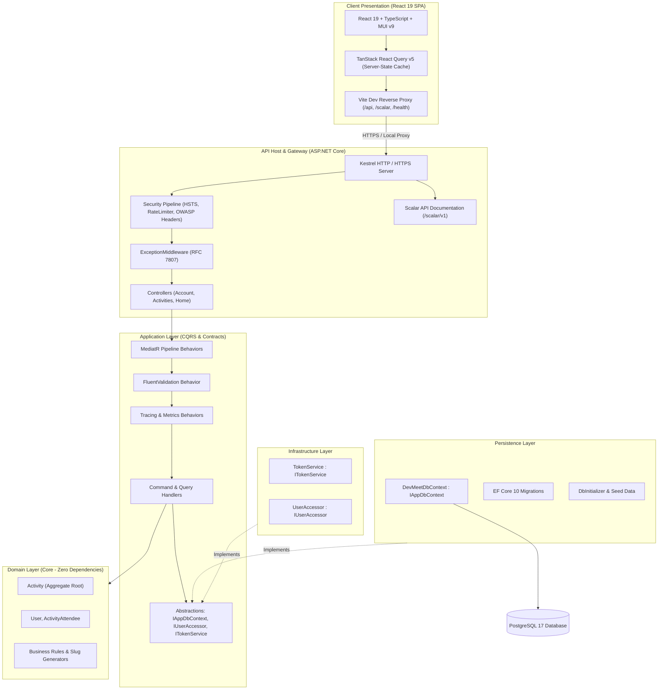
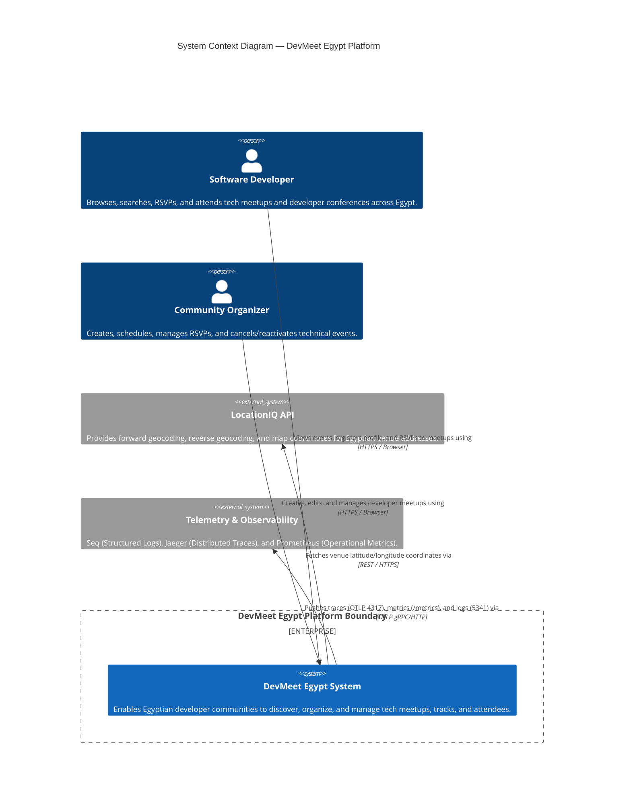
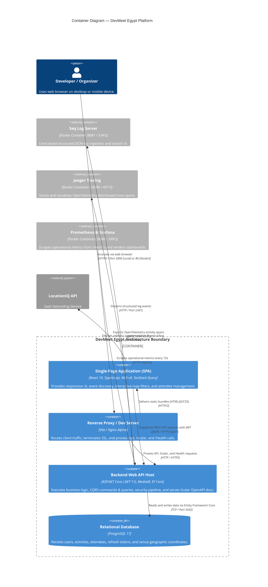
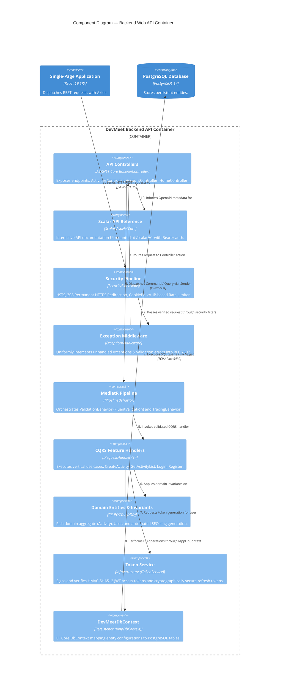
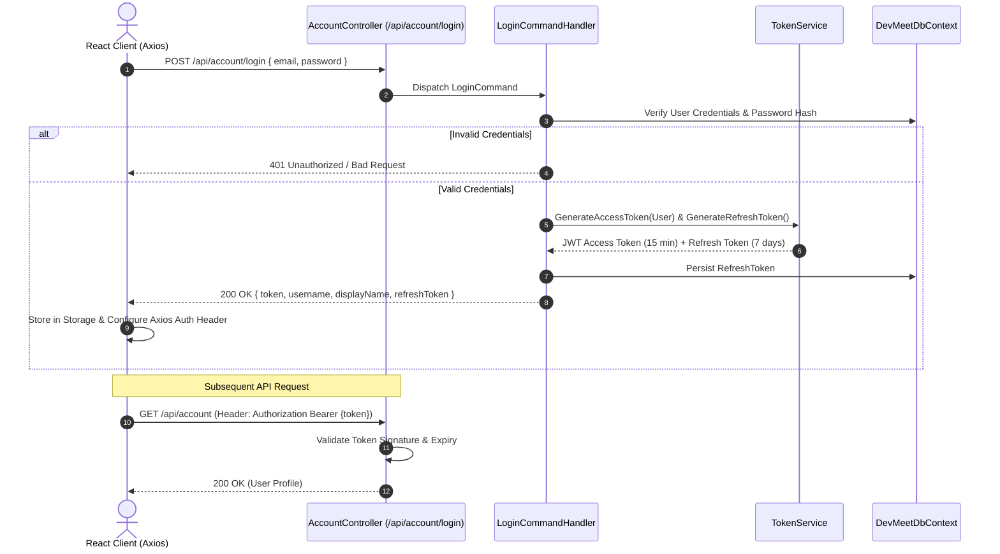

# 🏗️ Architecture Blueprint & Design Specification

> **Project:** DevMeet Egypt  
> **Engineering Level:** Senior Full-Stack Architecture  
> **Target Framework:** .NET 11.0 / ASP.NET Core & React 19 SPA  
> **Last Updated:** October 2026  

---

## 📑 Table of Contents

1. [Executive Summary & Core Tenets](#1-executive-summary--core-tenets)
2. [High-Level Architectural Topology](#2-high-level-architectural-topology)
3. [C4 Architecture Model](#3-c4-architecture-model)
   - [3.1 Level 1: System Context Diagram](#31-level-1-system-context-diagram)
   - [3.2 Level 2: Container Diagram](#32-level-2-container-diagram)
   - [3.3 Level 3: Component Diagram (Backend API Container)](#33-level-3-component-diagram-backend-api-container)
   - [3.4 Level 4: Dynamic Diagram (CQRS Event Creation Flow)](#34-level-4-dynamic-diagram-cqrs-event-creation-flow)
4. [Layer-by-Layer Detailed Breakdown](#4-layer-by-layer-detailed-breakdown)
   - [4.1 Domain Layer (The Enterprise Core)](#41-domain-layer-the-enterprise-core)
   - [4.2 Application Layer (CQRS & Business Orchestration)](#42-application-layer-cqrs--business-orchestration)
   - [4.3 Persistence Layer (Data Access & EF Core)](#43-persistence-layer-data-access--ef-core)
   - [4.4 Infrastructure Layer (External Services & Security)](#44-infrastructure-layer-external-services--security)
   - [4.5 API Layer (Host, Pipeline & Presentation Gateway)](#45-api-layer-host-pipeline--presentation-gateway)
   - [4.6 Client SPA (React 19 Frontend Architecture)](#46-client-spa-react-19-frontend-architecture)
5. [Request Processing & Pipeline Flow](#5-request-processing--pipeline-flow)
6. [Authentication & Authorization Lifecycle](#6-authentication--authorization-lifecycle)
7. [Cross-Cutting Concerns](#7-cross-cutting-concerns)
   - [7.1 Validation Pipeline (FluentValidation)](#71-validation-pipeline-fluentvalidation)
   - [7.2 Error Handling & RFC 7807 Problem Details](#72-error-handling--rfc-7807-problem-details)
   - [7.3 Telemetry & Distributed Tracing](#73-telemetry--distributed-tracing)
   - [7.4 Multi-Tier Defense-in-Depth Security](#74-multi-tier-defense-in-depth-security)
8. [Architectural Decision Records (ADRs)](#8-architectural-decision-records-adrs)

---

## 1. Executive Summary & Core Tenets

DevMeet Egypt is built as a modular monolith adhering strictly to the **Clean Architecture** (Onion Architecture) paradigm, complemented by **Domain-Driven Design (DDD)** tactical patterns, **Command Query Responsibility Segregation (CQRS)** via MediatR, and a modern **React 19 Single Page Application**.

### Guiding Architectural Principles

| Principle | Architectural Manifestation |
| :--- | :--- |
| **Dependency Inversion (DIP)** | The Domain and Application layers hold no direct references to outer infrastructure or data stores. Outer layers depend inward on abstractions. |
| **Separation of Concerns (SoC)** | Business rules, domain state transitions, data access, and HTTP concerns live in dedicated assemblies. |
| **CQRS Segregation** | Read operations (Queries) and write operations (Commands) are decoupled into dedicated models and handlers. |
| **Deterministic Result Pattern** | Handlers never throw exceptions for predictable flow control; they return standardized `Response<T>` payloads. |
| **Zero-Friction Dev Experience** | Vite dev server acts as a local reverse proxy, eliminating CORS and self-signed SSL certificate friction in local environments. |

---

## 2. High-Level Architectural Topology



---

## 3. C4 Architecture Model

The **C4 Model** (Context, Containers, Components, Code/Dynamic) provides hierarchical views of the system for both technical leaders and engineers.

---

### 3.1 Level 1: System Context Diagram

The System Context diagram establishes the boundary of the DevMeet Egypt platform, illustrating the human actors interacting with the system and external third-party software integrations.



---

### 3.2 Level 2: Container Diagram

The Container diagram zooms into the DevMeet Egypt boundary, showing the major deployable software containers, their technologies, and communication protocols.



---

### 3.3 Level 3: Component Diagram (Backend API Container)

The Component diagram dissects the **Backend Web API Container**, highlighting how Clean Architecture and CQRS slices assemble inside the ASP.NET Core host:



---

### 3.4 Level 4: Dynamic Diagram (CQRS Event Creation Flow)

The Dynamic diagram details the runtime collaboration between components during the creation of a new technical event:

```mermaid
C4Dynamic
    title Dynamic Diagram — Event Creation with Validation and Persistence Flow

    actor user as "Community Organizer"
    Component(spa, "Create Event Form", "React 19 Hook Form", "Collects event details & validates with Zod")
    Component(api, "ActivitiesController", "API Layer", "Receives POST /api/activities")
    Component(pipeline, "ValidationBehavior", "MediatR Pipeline", "Executes FluentValidation rules")
    Component(handler, "CreateActivityCommandHandler", "Application Layer", "Orchestrates business logic")
    Component(domain, "Activity Aggregate Root", "Domain Layer", "Enforces invariants & generates slug")
    Component(db, "DevMeetDbContext", "Persistence Layer", "Persists changes to PostgreSQL")

    Rel(user, spa, "1. Submits form details (Title, Venue, Date, Category)")
    Rel(spa, api, "2. Sends POST /api/activities with Bearer JWT")
    Rel(api, pipeline, "3. Dispatches CreateActivityCommand via MediatR")
    Rel(pipeline, pipeline, "4. Executes CreateActivityValidator (FluentValidation)")
    Rel(pipeline, handler, "5. Passes validated command to handler")
    Rel(handler, domain, "6. Instantiates Activity aggregate with private setters")
    Rel(domain, domain, "7. Computes SEO slug and validates invariant rules")
    Rel(handler, db, "8. Adds entity to DbSet<Activity> and calls SaveChangesAsync()")
    Rel(db, handler, "9. Commits SQL INSERT and returns generated Activity ID")
    Rel(handler, api, "10. Returns Response<string>.Success(activityId)")
    Rel(api, spa, "11. Returns HTTP 200 OK with Activity ID payload")
    Rel(spa, user, "12. Invalidates React Query cache & navigates to event view")
```

---

## 4. Layer-by-Layer Detailed Breakdown

### 4.1 Domain Layer (The Enterprise Core)
- **Assembly:** `Domain.csproj`
- **Dependencies:** **Zero external dependencies.** (No EF Core, no ASP.NET, no third-party libraries).
- **Responsibilities:**
  - **Aggregate Roots:** The `Activity` aggregate root encapsulates event identity, scheduling, venue coordinates, and attendee lists.
  - **Encapsulated State:** Private property setters prevent external corruption of state. All state changes occur through explicit domain methods (`UpdateDetails()`, `CancelActivity()`, `ReactivateActivity()`).
  - **Domain Invariants:** Enforces business constraints (e.g., event date cannot be in the past, slugs are generated deterministically).

### 4.2 Application Layer (CQRS & Business Orchestration)
- **Assembly:** `Application.csproj`
- **Dependencies:** `Domain.csproj`, `MediatR`, `FluentValidation`, `AutoMapper`.
- **Responsibilities:**
  - **CQRS Slices:** Grouped into feature vertical slices:
    - `Feature/Activities`: Commands (`CreateActivityCommand`, `EditActivityCommand`, `DeleteActivityCommand`) and Queries (`GetActivityListQuery`, `GetActivityDetailsQuery`).
    - `Feature/Account`: Authentication commands (`LoginCommand`, `RegisterCommand`, `RefreshTokenCommand`, `RevokeTokenCommand`) and Queries (`GetCurrentUserQuery`).
    - `Feature/Home`: Aggregated dashboard metrics and upcoming event queries (`GetHomePageDataQuery`).
  - **Cross-Cutting Pipeline Behaviors:**
    - `ValidationBehavior`: Automatically evaluates FluentValidation rules before any handler executes.
    - `LoggingBehavior`: Structured logging with MediatR request identifiers.
  - **Standardized Response Envelope:** Uses `Response<T>` wrapping `statusCode`, `succeeded`, `data`, and `errors`.

### 4.3 Persistence Layer (Data Access & EF Core)
- **Assembly:** `Persistence.csproj`
- **Dependencies:** `Application.csproj`, `Npgsql.EntityFrameworkCore.PostgreSQL`, `Microsoft.AspNetCore.Identity.EntityFrameworkCore`.
- **Responsibilities:**
  - Implements `IAppDbContext` defined by the Application layer.
  - Configures entity mappings via fluent configurations in `DevMeetDbContext`.
  - Manages automated Code-First schema migrations and seeding of Egyptian developer meetup datasets upon startup.

### 4.4 Infrastructure Layer (External Services & Security)
- **Assembly:** `Infrastructure.csproj`
- **Dependencies:** `Application.csproj`, `Microsoft.AspNetCore.Authentication.JwtBearer`.
- **Responsibilities:**
  - `TokenService`: Issues cryptographically signed HMAC-SHA512 JWT access tokens and cryptographically random refresh tokens.
  - `UserAccessor`: Safely reads the authenticated `ClaimsPrincipal` from `IHttpContextAccessor`.

### 4.5 API Layer (Host, Pipeline & Presentation Gateway)
- **Assembly:** `API.csproj`
- **Dependencies:** `Application.csproj`, `Infrastructure.csproj`, `Persistence.csproj`, `Scalar.AspNetCore`, `Serilog.AspNetCore`.
- **Responsibilities:**
  - Serves as the composition root (`Program.cs`, `ModuleApiDi.cs`).
  - Contains lightweight controller endpoints that validate routing parameters and delegate immediately to `ISender` (MediatR).
  - Hosts modular extension methods (`OpenApiExtensions`, `SecurityExtensions`, `CorsExtensions`).
  - Exposes interactive **Scalar API Reference** at `/scalar/v1`.

### 4.6 Client SPA (React 19 Frontend Architecture)
- **Directory:** `client/`
- **Tech Stack:** React 19, TypeScript, Vite, Material UI (MUI v9), TanStack Query v5, React Router.
- **Responsibilities:**
  - **Server State Management:** TanStack React Query maintains an in-memory client cache with automatic background invalidation on mutations.
  - **Vite Reverse Proxy:** Forwards `/api`, `/scalar`, `/openapi`, and `/health` to the backend Kestrel server, eliminating cross-port CORS and dev certificate warnings.
  - **Form Validation:** React Hook Form coupled with **Zod** schema validations for instant client-side feedback.

---

## 5. Request Processing & Pipeline Flow

Every inbound HTTP request traverses a hardened middleware pipeline before reaching the CQRS handler:

```mermaid
sequenceDiagram
    autonumber
    actor User as Browser / Frontend
    participant Proxy as Vite Reverse Proxy
    participant Kestrel as Kestrel Web Server
    participant Security as Security & Rate Limiter MW
    participant ErrorMW as ExceptionMiddleware
    participant API as ActivitiesController
    participant Pipeline as MediatR Pipeline (Validation & Tracing)
    participant Handler as CreateActivityCommandHandler
    participant DB as PostgreSQL (DevMeetDbContext)

    User->>Proxy: POST /api/activities (Bearer Token + JSON Payload)
    Proxy->>Kestrel: Forward to Backend Host (localhost:7223)
    Kestrel->>Security: Enforce HSTS, OWASP Headers & Rate Limiting
    alt Rate Limit Exceeded
        Security-->>User: 429 Too Many Requests (Retry-After Header)
    else Rate Limit OK
        Security->>ErrorMW: Pass down pipeline
        ErrorMW->>API: Route to Controller Action
        API->>Pipeline: Send(CreateActivityCommand)
        Pipeline->>Pipeline: Validate with FluentValidation
        alt Validation Rules Fail
            Pipeline-->>ErrorMW: Throw ValidationException
            ErrorMW-->>User: 400 Bad Request (RFC 7807 Problem Details)
        else Validation Passes
            Pipeline->>Handler: Handle(Command, CancellationToken)
            Handler->>DB: Add Activity & Commit Transaction
            DB-->>Handler: Transaction Committed
            Handler-->>API: Response<string>.Success(activityId)
            API-->>User: 200 OK { statusCode: 200, succeeded: true, data: "guid" }
        end
    end
```



---

## 6. Authentication & Authorization Lifecycle

DevMeet Egypt implements a stateless JWT authentication architecture combined with secure refresh tokens:



---

## 7. Cross-Cutting Concerns

### 7.1 Validation Pipeline (FluentValidation)
- Validators are declared next to commands in vertical slices (e.g., `CreateActivityValidator`).
- Executed automatically by `ValidationBehavior<TRequest, TResponse>`.
- Any validation failure throws a `ValidationException` containing property-level error lists, mapped directly to RFC 7807 responses.

### 7.2 Error Handling & RFC 7807 Problem Details
- Unhandled exceptions are intercepted centrally by [`ExceptionMiddleware.cs`](file:///c:/Users/ahmed/OneDrive/Desktop/FullStackDotNEtREACT/API/Middleware/ExceptionMiddleware.cs).
- Standardized error format:
  ```json
  {
    "type": "https://tools.ietf.org/html/rfc9110#section-15.5.1",
    "title": "One or more validation errors occurred.",
    "status": 400,
    "errors": {
      "Title": ["The Title field is required."]
    },
    "traceId": "00-805c882070a7895de57164f2d366c2f7-01"
  }
  ```

### 7.3 Telemetry & Distributed Tracing
- **OpenTelemetry SDK:** Instruments inbound ASP.NET Core requests, Entity Framework Core queries, and outbound HTTP client requests.
- **Exporters:**
  - **Jaeger (OTLP gRPC 4317):** Visual distributed traces for query bottleneck detection.
  - **Prometheus (Scraping `/metrics`):** Request rates, error rates, and duration histograms.
  - **Seq (OTLP HTTP 5341):** Structured centralized logging with Trace ID correlation.

### 7.4 Multi-Tier Defense-in-Depth Security
- **Strict HSTS:** `max-age=31536000; includeSubDomains; preload`.
- **Permanent HTTPS Redirection:** Upgrades insecure requests to HTTPS (308 Permanent Redirect).
- **Rate Limiting:**
  - Global Sliding Window: 100 req/min per IP.
  - Auth Fixed Window: 10 req/min for `/login` and `/register`.
- **OWASP Hardening Headers:** `nosniff`, `DENY`, `strict-origin-when-cross-origin`, `X-XSS-Protection`.

---

## 8. Architectural Decision Records (ADRs)

### ADR-001: Clean Architecture & CQRS Segregation
- **Context:** The application manages complex business invariants, diverse query shapes, and multiple integration points.
- **Decision:** Adopt Clean Architecture with 4 distinct assemblies (`Domain`, `Application`, `Persistence`, `Infrastructure`) paired with MediatR CQRS.
- **Consequences:** Superior unit testability, domain isolation, and clean boundaries. Requires upfront scaffolding of queries and commands.

### ADR-002: Scalar API Reference over Swagger UI
- **Context:** .NET 9+ deprecates out-of-the-box Swashbuckle in favor of built-in `Microsoft.AspNetCore.OpenApi`.
- **Decision:** Implement **Scalar.AspNetCore** for OpenAPI v1 visualization.
- **Consequences:** Modern, fast, dark-themed UI with integrated JWT Bearer authentication, request generation in multiple languages (C#, cURL, JS), and zero external Swagger dependencies.

### ADR-003: Vite Reverse Proxy for Development
- **Context:** Developers frequently encountered `ERR_CERT_AUTHORITY_INVALID` and CORS issues when calling `https://localhost:7223` from `localhost:3000`.
- **Decision:** Configure Vite's dev server `proxy` in `vite.config.ts` to forward `/api`, `/scalar`, and `/health` with `secure: false`.
- **Consequences:** Transparent same-origin requests from the browser, zero CORS configuration needed in local development, and seamless transition to production Nginx reverse proxy.

### ADR-004: Standardized `Response<T>` Envelope
- **Context:** Inconsistent API payloads between direct models and error objects complicate frontend state handling.
- **Decision:** Enforce `Response<T>` envelope wrapping status code, success boolean, data payload, and error messages.
- **Consequences:** Uniform client-side unwrapping, guaranteed structure across all endpoints, and cleaner diagnostic handling.
