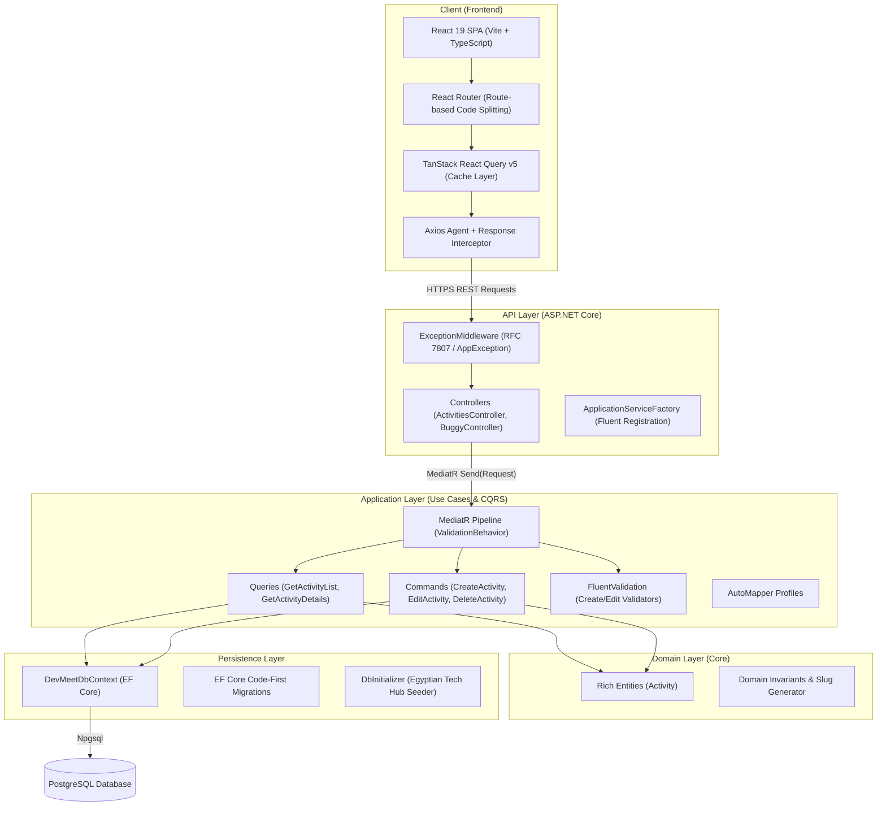
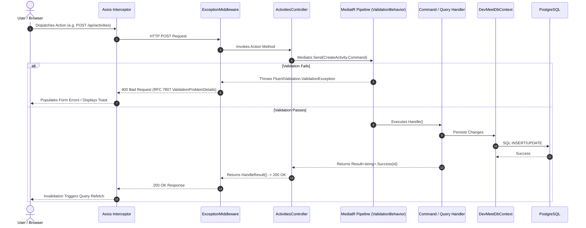
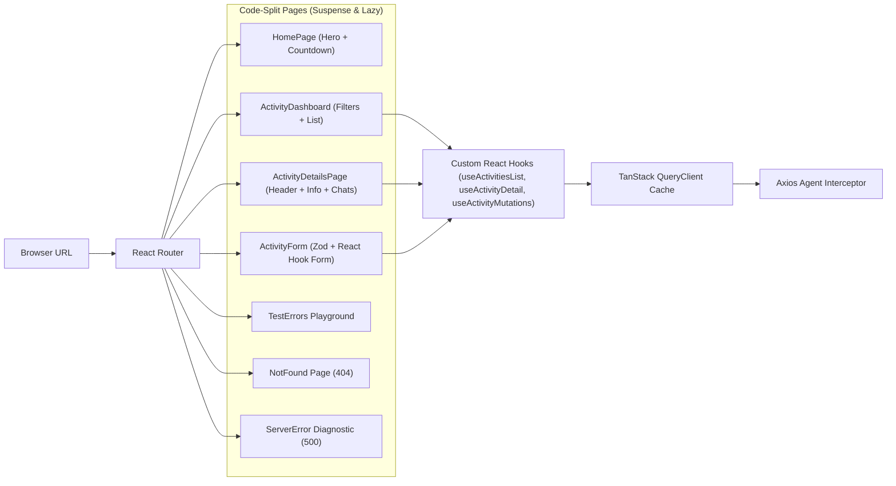

# 🏛️ DevMeet Egypt (Reactivities)

[](https://dotnet.microsoft.com/)
[](https://react.dev/)
[](https://www.typescriptlang.org/)
[](https://www.postgresql.org/)
[](https://vitejs.dev/)
[](https://mui.com/)
[](https://tanstack.com/query/latest)

> **DevMeet Egypt** (Reactivities) is an enterprise-grade full-stack web application designed for organizing, discovering, and managing developer meetups, tech conferences, hackathons, and workshops across Egypt (Cairo, Giza, Alexandria, Mansoura, Assiut).
> 
> Engineered from the ground up using **Clean Architecture** (Onion Architecture), **Domain-Driven Design (DDD)** rich domain models, and the **CQRS** pattern with **MediatR** on ASP.NET Core, paired with a modern **React 19 Single Page Application (SPA)** powered by **Vite**, **TypeScript**, **Material UI v9**, and **TanStack React Query v5**.

---

## 📑 Table of Contents

- [Architectural Highlights](#-architectural-highlights)
- [System Architecture & Diagrams](#-system-architecture--diagrams)
  - [1. Onion Architecture & Layers](#1-onion-architecture--layers)
  - [2. CQRS & Error Handling Pipeline](#2-cqrs--error-handling-pipeline)
  - [3. Frontend State & Routing Flow](#3-frontend-state--routing-flow)
- [Domain-Driven Design (DDD) Model](#-domain-driven-design-ddd-model)
- [Resilient Error Handling System](#-resilient-error-handling-system)
- [Tech Stack & Ecosystem](#-tech-stack--ecosystem)
- [Project Directory Structure](#-project-directory-structure)
- [API Reference & Endpoints](#-api-reference--endpoints)
- [Prerequisites & Environment Configuration](#-prerequisites--environment-configuration)
- [Getting Started](#-getting-started)
  - [Option A: Running PostgreSQL via Docker](#option-a-running-postgresql-via-docker-recommended)
  - [Option B: Local PostgreSQL Service](#option-b-local-postgresql-service)
  - [Backend Setup](#1-backend-setup-aspnet-core)
  - [Frontend Setup](#2-frontend-setup-react-19--vite)
- [Frontend Features & UI Walkthrough](#-frontend-features--ui-walkthrough)
- [Developer CLI Cheat Sheet](#-developer-cli-cheat-sheet)
- [Database Migrations & Seeding](#-database-migrations--seeding)
- [License & Authors](#-license)

---

## 💡 Architectural Highlights

| Pillar | Implementation |
| :--- | :--- |
| **Clean Architecture** | Strict dependency flow where Domain has zero external dependencies, Application encapsulates all use cases, and Infrastructure/API depend solely inward. |
| **Domain-Driven Design (DDD)** | Rich `Activity` entity with private setters, encapsulation, domain invariants, business mutation methods, and automatic SEO-friendly slug generation. |
| **CQRS Pattern** | Complete separation of read operations (Queries) and write operations (Commands) using **MediatR**. |
| **Fluent Validation Pipeline** | Cross-cutting MediatR `IPipelineBehavior` executing FluentValidation rules automatically before request handlers are reached. |
| **Standardized Result Pattern** | Handlers return strongly-typed `Result<T>` objects, eliminating exceptions for control flow and mapping cleanly to HTTP 200, 400, or 404. |
| **Enterprise Error Middleware** | Centralized `ExceptionMiddleware` transforming unhandled exceptions into structured `AppException` payloads with unique `TraceId`, and validation errors into RFC 7807 `ValidationProblemDetails`. |
| **Client-Side Diagnostics** | Axios interceptors intelligent routing: preserves form state on failed mutations (showing Trace ID toasts), navigates to diagnostic `<ServerError />` pages on query failures, and redirects malformed IDs to `<NotFound />`. |
| **Server-State Sync** | **TanStack Query v5** manages server state caching, background refetching, and instant cache invalidations on mutations. |
| **Performance & Code-Splitting** | Route-level lazy loading (`React.lazy` and `<Suspense />`) in React Router, reducing initial bundle size and initial load time. |

---

## 🏛 System Architecture & Diagrams

### 1. Onion Architecture & Layers



---

### 2. CQRS & Error Handling Pipeline



---

### 3. Frontend State & Routing Flow



---

## 🧩 Domain-Driven Design (DDD) Model

The core domain entity [`Activity`](file:///c:/Users/ahmed/OneDrive/Desktop/FullStackDotNEtREACT/Domain/Activity.cs) follows Domain-Driven Design principles:

- **Private Setters & Encapsulation**: Internal properties cannot be altered arbitrarily from outside the domain boundary.
- **Factory Method**: Instantiation is regulated by `Activity.Create(...)`, guaranteeing that invariants (title presence, valid dates, coordinates) are validated upfront.
- **Rich Domain Methods**: State changes occur through explicit domain operations:
  - `UpdateTitle(string newTitle)`: Modifies title and automatically triggers slug regeneration.
  - `UpdateDetails(...)`: Updates core event parameters and tags.
  - `UpdateLocation(...)`: Updates city, venue, and geographical latitude/longitude.
  - `Cancel()` / `Reactivate()`: Flips event status lifecycle without hard deletes.
  - `AddTag(string tag)` / `RemoveTag(...)` / `SetTags(...)`: Enforces tag formatting and uniqueness.
- **URL Slug Generation**: Built-in [`SlugHelper`](file:///c:/Users/ahmed/OneDrive/Desktop/FullStackDotNEtREACT/Domain/Common/SlugHelper.cs) creates readable, SEO-optimized slugs (e.g., `cairo-dotnet-9-distributed-systems-masterclass`) enabling intuitive routing: `/activities/:id/:slug`.

```csharp
// Example: Creating an Activity via Domain Factory
var activity = Activity.Create(
    title: "Cairo .NET 9 & Distributed Systems Masterclass",
    description: "Technical meetup on Clean Architecture and CQRS...",
    category: "BackEnd",
    date: DateTime.UtcNow.AddDays(7),
    city: "Cairo",
    venue: "The Greek Campus, Downtown Cairo",
    latitude: 30.0444,
    longitude: 31.2357,
    level: "Advanced",
    tags: [".NET 9", "PostgreSQL", "Clean Architecture", "Redis"]
);
```

---

## 🛡 Resilient Error Handling System

The application features a production-grade diagnostic and fault-tolerance architecture:

```
├── Backend Pipeline
│   ├── FluentValidation ─────> Throws ValidationException if DTO invalid
│   ├── ExceptionMiddleware ───> Intercepts all unhandled errors
│   │   ├── ValidationException -> Returns 400 Bad Request with RFC 7807 ValidationProblemDetails
│   │   └── Unhandled Exception -> Logs with TraceId and returns 500 AppException
│   └── Result<T> Pattern ─────> BaseApiController.HandleResult() translates 200, 400, 404
│
└── Frontend Interceptors
    ├── Status 400 ───────────> Parses model state errors; redirects bad GUID lookups to /not-found
    ├── Status 401 ───────────> Triggers "Unauthorised" toast notification
    ├── Status 404 ───────────> Navigates seamlessly to /not-found
    └── Status 500
        ├── On Mutations ─────> Keeps user on form (prevents lost inputs) + displays Trace ID toast
        └── On Queries ───────> Saves error to sessionStorage + navigates to /server-error
```

### Diagnostic Error Test Lab (`/errors`)
The backend provides a dedicated [`BuggyController`](file:///c:/Users/ahmed/OneDrive/Desktop/FullStackDotNEtREACT/API/Controllers/BuggyController.cs), and the frontend features an interactive diagnostic page at `/errors` to test and demonstrate error response handling:
- **400 Bad Request**: Tests general error response parsing.
- **401 Unauthorized**: Tests auth failure toasts.
- **404 Not Found**: Tests automatic redirection to the not-found view.
- **500 Server Error**: Tests diagnostic stack trace visualization and Trace ID persistence.
- **Validation Error**: Tests multi-field FluentValidation error extraction.

---

## 💻 Tech Stack & Ecosystem

### Backend Architecture
| Package / Technology | Version | Purpose |
| :--- | :--- | :--- |
| **.NET SDK / C#** | `net11.0` / `net10.0` | High-performance managed runtime and web framework |
| **ASP.NET Core Web API** | Built-in | RESTful HTTP API controllers and middleware pipeline |
| **PostgreSQL** | `16+` | Enterprise relational database |
| **Entity Framework Core** | `10.0.4` | Code-First ORM and migration management |
| **Npgsql.EntityFrameworkCore.PostgreSQL** | `10.0.0` | High-performance PostgreSQL database provider for EF Core |
| **MediatR** | `14.2.0` | In-process mediator implementing CQRS handlers and pipeline behaviors |
| **FluentValidation** | `12.1.1` | Strongly-typed business validation rules for commands and DTOs |
| **AutoMapper** | `16.2.0` | Convention-based DTO-to-entity and entity-to-DTO projection |
| **Microsoft.AspNetCore.OpenApi** | `10.0.5` | OpenAPI specification generation |

### Frontend Architecture
| Package / Technology | Version | Purpose |
| :--- | :--- | :--- |
| **React** | `19.2.8` | Component architecture utilizing modern concurrent features and hooks |
| **TypeScript** | `~6.0.2` | End-to-end static typing for props, models, and API responses |
| **Vite** | `^8.3.0` | Lightning-fast build tool and development server with HMR |
| **Material UI (MUI)** | `^9.4.0` | Design system with customized theme tokens, typography, and dark/light modes |
| **Emotion** | `^11.14` | CSS-in-JS styling engine underpinning MUI components |
| **TanStack Query (React Query)** | `^5.103.2` | Asynchronous server-state caching, deduping, and background synchronization |
| **React Router** | `^7.18 / ^8.4` | Client-side routing with lazy-loaded route chunks and code splitting |
| **React Hook Form** | `^7.88.0` | Performant, uncontrolled form state management |
| **Zod** | `^4.6.5` | Schema declaration and client-side form validation |
| **Axios** | `^1.20.0` | HTTP client with request/response interceptors and delay simulation |
| **Date-fns** | `^4.4.0` | Modern, modular date manipulation and formatting library |
| **React-Calendar** | `^6.0.1` | Interactive calendar component for date-based event filtering |
| **React-Toastify** | `^11.1.0` | Non-intrusive toast notifications for success and error alerts |
| **Oxlint** | `^1.81.0` | High-speed Rust-based linter for static analysis |

---

## 📂 Project Directory Structure

```text
FullStackDotNEtREACT/
├── Reactivities.sln                          # Master Visual Studio / .NET Solution
│
├── API/                                      # Web API Entry Point & HTTP Boundary
│   ├── Controllers/                          # REST Controllers
│   │   ├── ActivitiesController.cs           # CRUD operations via MediatR
│   │   ├── BaseApiController.cs              # Common mediator & Result<T> handler
│   │   └── BuggyController.cs                # Diagnostic endpoints (400, 401, 404, 500)
│   ├── Extensions/                           # Modular Service Registrations
│   │   ├── ApplicationServiceExtensions.cs   # IServiceCollection root orchestrator
│   │   ├── ApplicationServiceFactory.cs      # Fluent builder for application services
│   │   ├── CorsExtensions.cs                 # Development & production CORS policies
│   │   ├── CqrsExtensions.cs                 # MediatR & pipeline behaviors registration
│   │   ├── DatabaseExtensions.cs             # DbContext & Npgsql connection setup
│   │   ├── MappingExtensions.cs              # AutoMapper profiles registration
│   │   └── MigrationExtensions.cs            # Automated startup migrations & seeding
│   ├── Middleware/
│   │   └── ExceptionMiddleware.cs            # RFC 7807 & AppException middleware
│   ├── Options/
│   │   └── DatabaseOptions.cs                # Strongly-typed database configuration
│   ├── Program.cs                            # Host setup, middleware pipeline, entry point
│   ├── appsettings.Development.json          # Development connection string & settings
│   └── appsettings.json                      # Base configuration
│
├── Application/                              # Business Logic & CQRS Layer
│   ├── Activities/
│   │   ├── Commands/                         # State-altering operations
│   │   │   ├── CreateActivity.cs             # Command + Handler
│   │   │   ├── EditActivity.cs               # Command + Handler
│   │   │   └── DeleteActivity.cs             # Command + Handler
│   │   ├── Queries/                          # Read-only operations
│   │   │   ├── GetActivityList.cs            # Retrieves collection of activities
│   │   │   └── GetActivityDetails.cs         # Retrieves single activity by ID
│   │   ├── DTO/                              # Data Transfer Objects
│   │   │   ├── CreateActivityDto.cs          # Incoming payload for creation
│   │   │   └── EditActivityDto.cs            # Incoming payload for updates
│   │   └── Validators/                       # FluentValidation Schemas
│   │       ├── BaseActivityValidator.cs      # Reusable activity validation rules
│   │       ├── CreateActivityValidator.cs    # Validator for CreateActivityDto
│   │       └── EditActivityValidator.cs      # Validator for EditActivityDto
│   └── Core/
│       ├── AppException.cs                   # Standardized error transfer model
│       ├── MappingProfiles.cs                # AutoMapper mapping definitions
│       ├── Result.cs                         # Generic Result<T> failure/success pattern
│       └── ValidationBehavior.cs             # MediatR IPipelineBehavior validator
│
├── Domain/                                   # Enterprise Business Entities (Zero Dependencies)
│   ├── Activity.cs                           # Rich Domain Model with DDD invariants
│   └── Common/
│       └── SlugHelper.cs                     # URL-friendly slug generator
│
├── Persistence/                              # Data Access & Entity Framework Layer
│   ├── AppDbContext.cs                       # Primary EF Core DbContext alias
│   ├── DevMeetDbContext.cs                   # DbContext with Activity entity mapping
│   ├── DbInitializer.cs                      # Seed data engine (Egyptian Tech Events)
│   └── Migrations/                           # Code-First database migrations
│
└── client/                                   # Modern React 19 Frontend SPA
    ├── public/                               # Static public assets
    ├── src/
    │   ├── App/
    │   │   ├── Layout/                       # Application Shell
    │   │   │   ├── App.tsx                   # Main layout container
    │   │   │   └── NavBar.tsx                # Responsive top navigation bar
    │   │   └── Router/
    │   │       └── Router.tsx                # React Router v7/v8 config with React.lazy
    │   ├── features/                         # Feature-Driven Slices
    │   │   ├── activities/                   # Activities Feature Module
    │   │   │   ├── api/                      # Feature-specific API queries & mutations
    │   │   │   ├── components/               # Domain subcomponents
    │   │   │   │   ├── ActivityCard.tsx      # Individual event card with tags & actions
    │   │   │   │   ├── ActivityDetailsChats.tsx  # Event comments & chat placeholder
    │   │   │   │   ├── ActivityDetailsHeaders.tsx# Hero header with cancellation banner
    │   │   │   │   ├── ActivityDetailsInfo.tsx   # Date, venue, and geographical details
    │   │   │   │   ├── ActivityDetailsSideBar.tsx# Host and attendees roster
    │   │   │   │   ├── ActivityFilter.tsx        # Filter by category and date picker
    │   │   │   │   └── ActivityList.tsx          # Grouped list of activities
    │   │   │   ├── hooks/                    # TanStack Query custom hooks
    │   │   │   │   ├── useActivitiesList.ts  # Fetches and caches activity list
    │   │   │   │   ├── useActivityDetail.ts  # Fetches single activity by ID
    │   │   │   │   └── useActivityMutations.ts# Create, edit, delete mutations with cache invalidation
    │   │   │   └── pages/                    # Routed Page Views
    │   │   │       ├── ActivityDashboard.tsx # Filterable dashboard & event feed
    │   │   │       ├── ActivityDetailsPage.tsx# In-depth event information view
    │   │   │       └── ActivityForm.tsx      # React Hook Form + Zod create/edit page
    │   │   ├── errors/                       # Diagnostic & Error Pages
    │   │   │   ├── NotFound.tsx              # 404 page with return action
    │   │   │   ├── ServerError.tsx           # 500 error view with stack trace explorer
    │   │   │   ├── TestErrors.tsx            # Interactive error testing workbench
    │   │   │   └── ValidationError.tsx       # Validation errors modal/banner
    │   │   └── home/
    │   │       └── HomePage.tsx              # Landing page with live event countdown
    │   ├── shared/                           # Reusable Shared Utilities
    │   │   ├── api/
    │   │   │   └── agent.ts                  # Axios instance with interceptors & latency simulation
    │   │   ├── components/                   # Generic UI components (Spinner, Badges)
    │   │   ├── schemas/                  # Shared Zod validation schemas
    │   │   ├── types/                        # TypeScript domain interfaces
    │   │   └── utils/                        # Formatting & helper utilities
    │   ├── theme/                            # Design tokens & Material UI theme
    │   ├── index.html                        # HTML entry point
    │   ├── main.tsx                          # App root with QueryClientProvider & CssBaseline
    │   └── vite.config.ts                    # Vite config with React plugin & mkcert
    └── package.json                          # Frontend dependencies and scripts
```

---

## 📡 API Reference & Endpoints

Base URL (Development HTTPS): `https://localhost:7223/api`  
Base URL (Development HTTP): `http://localhost:5096/api`

### Activities Management

| Method | Endpoint | Description | Request Payload | Response Status |
| :--- | :--- | :--- | :--- | :--- |
| `GET` | `/api/activities` | Fetch all activities | None | `200 OK` (`Activity[]`) |
| `GET` | `/api/activities/{id}` | Fetch a single activity by ID | None | `200 OK` (`Activity`) or `404 Not Found` |
| `POST` | `/api/activities` | Create a new tech event | `CreateActivityDto` (JSON) | `200 OK` (`string id`) or `400 Bad Request` |
| `PUT` | `/api/activities/{id}` | Update an existing activity | `EditActivityDto` (JSON) | `200 OK` or `400 Bad Request` |
| `DELETE` | `/api/activities/{id}` | Delete an activity | None | `200 OK` or `400 Bad Request` |

#### Sample Create Activity Payload (`POST /api/activities`)
```json
{
  "title": "Alexandria Cloud & Kubernetes Summit",
  "description": "A comprehensive gathering of DevOps engineers in Alexandria focusing on cloud-native deployments and container security.",
  "category": "DevOps",
  "date": "2026-10-15T09:00:00Z",
  "city": "Alexandria",
  "venue": "Bibliotheca Alexandrina Conference Center",
  "latitude": 31.2089,
  "longitude": 29.9092,
  "level": "Intermediate",
  "tags": ["Kubernetes", "Docker", "DevOps", "Cloud Native", "CI/CD"]
}
```

### Diagnostic & Error Simulation Endpoints (`BuggyController`)

| Method | Endpoint | Description | Simulation Purpose |
| :--- | :--- | :--- | :--- |
| `GET` | `/api/buggy/bad-request` | Returns standard `400 Bad Request` | Tests client 400 error toast handling |
| `GET` | `/api/buggy/not-found` | Returns `404 Not Found` | Tests client redirect to `/not-found` |
| `GET` | `/api/buggy/server-error` | Throws an unhandled exception | Tests `ExceptionMiddleware` & `<ServerError />` |
| `GET` | `/api/buggy/unauthorized` | Returns `401 Unauthorized` | Tests auth failure notifications |

---

## ⚙️ Prerequisites & Environment Configuration

Ensure the following tools are installed:

1. **.NET SDK**: Version 10 or 11 preview ([Download .NET](https://dotnet.microsoft.com/download))
2. **Node.js**: Version 18.x or 20.x+ ([Download Node.js](https://nodejs.org/))
3. **PostgreSQL**: Version 15+ or **Docker Desktop** ([Download Docker](https://www.docker.com/))

### Configuration Settings

#### Backend: [`API/appsettings.Development.json`](file:///c:/Users/ahmed/OneDrive/Desktop/FullStackDotNEtREACT/API/appsettings.Development.json)
```json
{
  "Logging": {
    "LogLevel": {
      "Default": "Information",
      "Microsoft.AspNetCore": "Warning"
    }
  },
  "ConnectionStrings": {
    "DefaultConnection": "Host=localhost;Port=5432;Database=reactivities;Username=postgres;Password=your_password"
  }
}
```

#### Frontend: [`client/.env.development`](file:///c:/Users/ahmed/OneDrive/Desktop/FullStackDotNEtREACT/client/.env.development)
```env
VITE_API_URL=https://localhost:7223/api
```

---

## 🚀 Getting Started

### Option A: Running PostgreSQL via Docker (Recommended)

Run PostgreSQL in a lightweight Docker container with persistent storage:

```bash
docker run --name reactivities-postgres \
  -e POSTGRES_USER=postgres \
  -e POSTGRES_PASSWORD=postgres \
  -e POSTGRES_DB=reactivities \
  -p 5432:5432 \
  -v postgres_data:/var/lib/postgresql/data \
  -d postgres:16-alpine
```

*(Ensure the password in [`API/appsettings.Development.json`](file:///c:/Users/ahmed/OneDrive/Desktop/FullStackDotNEtREACT/API/appsettings.Development.json) matches `postgres`)*.

---

### Option B: Local PostgreSQL Service

Ensure your local PostgreSQL service is running on port `5432` with a database named `reactivities` (or allow the app to automatically create it). Update the `DefaultConnection` password in `API/appsettings.Development.json`.

---

### 1. Backend Setup (ASP.NET Core)

1. Open a terminal in the solution root directory:
   ```bash
   dotnet restore
   ```

2. Trust the development HTTPS certificate:
   ```bash
   dotnet dev-certs https --trust
   ```

3. Run the API:
   ```bash
   dotnet run --project API
   ```
   > 💡 **Auto-Migration & Seeding**: On startup, [`MigrationExtensions`](file:///c:/Users/ahmed/OneDrive/Desktop/FullStackDotNEtREACT/API/Extensions/MigrationExtensions.cs) automatically executes pending EF Core migrations and seeds realistic Egypt tech meetups via [`DbInitializer`](file:///c:/Users/ahmed/OneDrive/Desktop/FullStackDotNEtREACT/Persistence/DbInitializer.cs).

4. Access the API:
   - **HTTPS**: `https://localhost:7223`
   - **HTTP**: `http://localhost:5096`
   - **OpenAPI Schema**: `https://localhost:7223/openapi/v1.json`

---

### 2. Frontend Setup (React 19 + Vite)

1. Navigate to the client folder:
   ```bash
   cd client
   ```

2. Install dependencies:
   ```bash
   npm install
   ```

3. Start the Vite development server:
   ```bash
   npm run dev
   ```

4. Open your browser and navigate to:
   ```text
   http://localhost:5173
   ```

---

## 🖥 Frontend Features & UI Walkthrough

### 1. Interactive Landing Page (`/`)
- **Live Countdown Clock**: Real-time ticker counting down days, hours, minutes, and seconds until the next scheduled tech conference.
- **Hero & Metrics**: Quick access to browse activities, create events, and inspect community statistics.
- **Featured Meetups**: Highlights upcoming flagship workshops across Cairo, Giza, and Alexandria.

### 2. Activity Dashboard (`/activities`)
- **Category Filter Tabs**: Fast filtering across tech domains:
  - `All Events`, `BackEnd`, `FrontEnd`, `CyberSecurity`, `DevOps`, `AI & Machine Learning`, `Mobile`.
- **Calendar Date Picker**: Interactive `react-calendar` allowing engineers to filter events by scheduled calendar dates.
- **Event Cards**: Rich Material UI cards displaying title, date, venue, city badge, experience level (`Beginner`, `Intermediate`, `Advanced`, `All Levels`), tags, and status.

### 3. Detailed Event View (`/activities/:id` & `/activities/:id/:slug`)
- **Hero Banner**: High-resolution category artwork, cancellation status alert, and quick action controls (Manage Event, Cancel/Reactivate).
- **Event Information Panel**: Schedule timestamp, exact address with interactive Google Maps lookup coordinates.
- **Attendees & Host Sidebar**: Overview of confirmed attendees and organizers.
- **Interactive Chat Tab**: Community discussion board placeholder.

### 4. Create & Edit Event Studio (`/createActivity`, `/manage/:id`)
- **Type-Safe Validation**: Integrated with **React Hook Form** and **Zod** schema validation for instant inline field feedback.
- **Dynamic Tag Selector**: Add custom technical topic tags (e.g. `Docker`, `PostgreSQL`, `React 19`).
- **Experience Level Selector**: Choose target audience proficiency (`Beginner`, `Intermediate`, `Advanced`, `All Levels`).
- **Geocoordinate Inputs**: Latitude and longitude precision for map positioning.

### 5. Error Testing Laboratory (`/errors`)
- **Interactive Test Suite**: Trigger and verify frontend handling for 400 Bad Request, 401 Unauthorized, 404 Not Found, 500 Internal Server Error, and validation errors.
- **Stack Trace Explorer**: In development, `500 Server Error` displays full stack traces, route path, HTTP method, and Trace ID with one-click copy.

---

## 🧰 Developer CLI Cheat Sheet

### Backend Commands (Root Directory)
```bash
# Build the entire solution
dotnet build

# Run the API with Hot Reload
dotnet watch --project API

# Add a new Entity Framework migration
dotnet ef migrations add <MigrationName> -p Persistence -s API

# Apply migrations manually to the database
dotnet ef database update -p Persistence -s API

# Remove the most recent migration (if not yet applied)
dotnet ef migrations remove -p Persistence -s API
```

### Frontend Commands (`/client` Directory)
```bash
# Start Vite development server
npm run dev

# Compile TypeScript and create production bundle
npm run build

# Run fast Oxlint static analysis
npm run lint

# Preview production build locally
npm run preview
```

---

## 🗄 Database Migrations & Seeding

The application manages data through **Entity Framework Core Code-First Migrations**:

- Located in [`Persistence/Migrations/`](file:///c:/Users/ahmed/OneDrive/Desktop/FullStackDotNEtREACT/Persistence/Migrations/).
- Database configuration is automatically registered in [`DatabaseExtensions.cs`](file:///c:/Users/ahmed/OneDrive/Desktop/FullStackDotNEtREACT/API/Extensions/DatabaseExtensions.cs).
- Pre-populated with realistic Egyptian tech community events via [`DbInitializer.cs`](file:///c:/Users/ahmed/OneDrive/Desktop/FullStackDotNEtREACT/Persistence/DbInitializer.cs):
  - **Cairo .NET 9 & Distributed Systems Masterclass** (The Greek Campus, Downtown Cairo)
  - **Red Team & Web Penetration Testing Workshop** (Smart Village ITIDA Hub, Giza)
  - **Modern React 19 & Next.js Performance Camp** (Bibliotheca Alexandrina, Alexandria)
  - **AI & LLM Fine-Tuning Hackathon** (AUC New Cairo)
  - **Cloud-Native Kubernetes & Platform Engineering Day** (Maadi Tech Ridge, Cairo)

---

## 📄 License

This project is licensed under the **MIT License**. Free for educational, community, and commercial use.