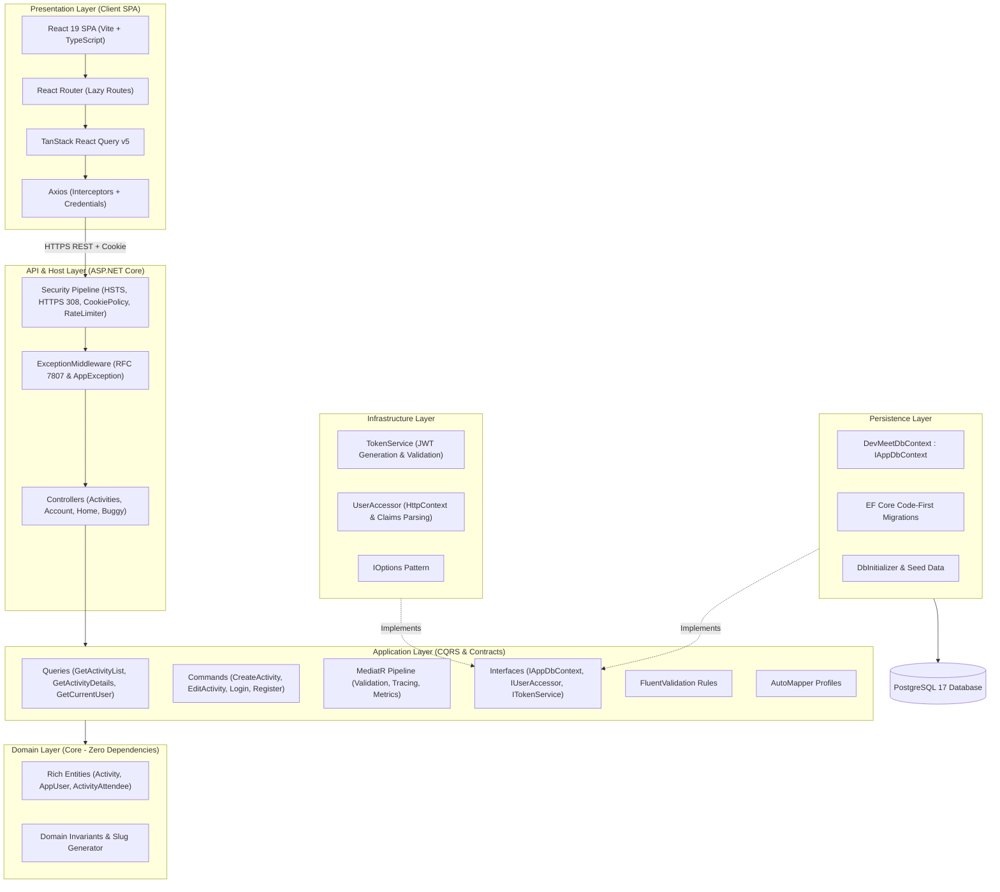
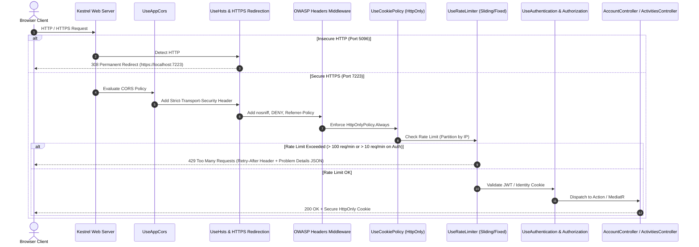
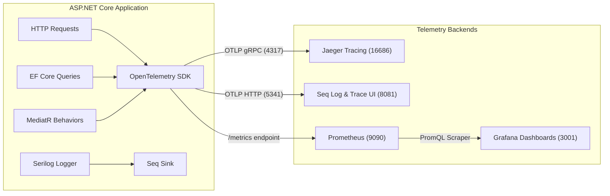
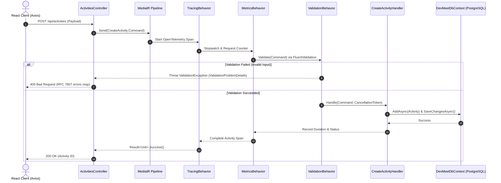
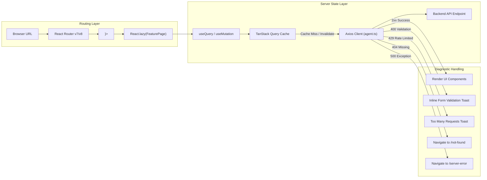

# 🏛️ DevMeet Egypt (Reactivities)

[](https://dotnet.microsoft.com/)
[](https://react.dev/)
[](https://www.typescriptlang.org/)
[](https://www.postgresql.org/)
[](https://owasp.org/)
[](https://hstspreload.org/)
[](https://learn.microsoft.com/en-us/aspnet/core/performance/rate-limit)
[](https://www.docker.com/)
[](https://opentelemetry.io/)
[](https://prometheus.io/)
[](https://grafana.com/)
[](https://www.jaegertracing.io/)
[](https://datalust.co/seq)
[](https://vitejs.dev/)
[](https://mui.com/)
[](https://tanstack.com/query/latest)

> **DevMeet Egypt** (Reactivities) is an enterprise-grade full-stack web application designed for organizing, discovering, and managing developer meetups, tech conferences, hackathons, and workshops across Egypt (Cairo, Giza, Alexandria, Mansoura, Assiut).
> 
> Engineered from the ground up using **Clean Architecture** (Onion Architecture), **Domain-Driven Design (DDD)** rich domain models, **Interface Segregation & Inversion of Control**, and the **CQRS** pattern with **MediatR** on ASP.NET Core, paired with a modern **React 19 Single Page Application (SPA)** powered by **Vite**, **TypeScript**, **Material UI v9**, and **TanStack React Query v5**.
>
> Hardened with a **Defense-in-Depth Security System** (HSTS Preload, Strict HTTPS Redirection, HttpOnly Secure Cookie Policy, OWASP Security Headers, and ASP.NET Core Sliding & Fixed Window Rate Limiting) and backed by a production-ready **Cloud-Native Observability Stack** (OpenTelemetry, Prometheus, Grafana, Jaeger, Seq) orchestrated seamlessly via **Docker Compose**.

---

## 📑 Table of Contents

- [Architectural Highlights](#-architectural-highlights)
- [Enterprise Defense-in-Depth Security](#-enterprise-defense-in-depth-security)
  - [1. HTTP Strict Transport Security (HSTS) & HTTPS-Only](#1-http-strict-transport-security-hsts--https-only)
  - [2. HttpOnly & Secure Cookie Policy](#2-httponly--secure-cookie-policy)
  - [3. Multi-Tier Rate Limiting (Sliding & Fixed Windows)](#3-multi-tier-rate-limiting-sliding--fixed-windows)
  - [4. OWASP Defense-in-Depth Security Headers](#4-owasp-defense-in-depth-security-headers)
- [System Architecture & Diagrams](#-system-architecture--diagrams)
  - [1. Clean Architecture & Layers](#1-clean-architecture--layers)
  - [2. Security & Request Pipeline Flow](#2-security--request-pipeline-flow)
  - [3. Observability & Telemetry Pipeline](#3-observability--telemetry-pipeline)
  - [4. CQRS Execution & Error Handling Flow](#4-cqrs-execution--error-handling-flow)
  - [5. Frontend State & Routing Flow](#5-frontend-state--routing-flow)
- [Domain-Driven Design (DDD) Model](#-domain-driven-design-ddd-model)
- [Enterprise Observability Stack](#-enterprise-observability-stack)
- [Resilient Error Handling System](#-resilient-error-handling-system)
- [Tech Stack & Ecosystem](#-tech-stack--ecosystem)
- [Project Directory Structure](#-project-directory-structure)
- [API Reference & Endpoints](#-api-reference--endpoints)
- [Port Mappings & Service Directory](#-port-mappings--service-directory)
- [Getting Started](#-getting-started)
  - [Option A: Full Docker Compose Stack (Recommended)](#option-a-full-docker-compose-stack-recommended)
  - [Option B: Local Development (.NET + Vite)](#option-b-local-development-net--vite)
- [Frontend Features & UI Walkthrough](#-frontend-features--ui-walkthrough)
- [Developer CLI Cheat Sheet](#-developer-cli-cheat-sheet)
- [Database Migrations & Seeding](#-database-migrations--seeding)
- [Troubleshooting & FAQ](#-troubleshooting--faq)
- [License](#-license)

---

## 💡 Architectural Highlights

| Pillar | Implementation |
| :--- | :--- |
| **Strict Clean Architecture** | Clean 4-layer architecture (`Domain` ➔ `Application` ➔ `Infrastructure` & `Persistence` ➔ `API`). Domain has zero dependencies. `Application` defines abstractions (`IAppDbContext`, `IUserAccessor`), and outer layers implement them. |
| **Domain-Driven Design (DDD)** | Rich `Activity` entity with private setters, business invariants, domain actions (`CancelActivity()`, `ReactivateActivity()`), and automated SEO-friendly slug generation. |
| **Interface Inversion** | Application layer does not reference Persistence or Infrastructure. Persistence implements `IAppDbContext` and Infrastructure implements `IUserAccessor` & `ITokenService`. |
| **CQRS Pattern** | Complete separation of read operations (Queries) and write operations (Commands) using **MediatR** without Service Locator anti-patterns. |
| **Defense-in-Depth Security** | Multi-tier security engine: HSTS preload policy, 308 permanent HTTPS redirection, strict HttpOnly/Secure cookie policy, OWASP defense headers, and IP-partitioned rate limiting. |
| **Rate Limiting Engine** | ASP.NET Core built-in rate limiter featuring a Sliding Window limiter (100 req/min per IP) and strict Fixed Window limiter (10 req/min) for auth endpoints to prevent brute-force attacks. |
| **Full Observability (OTLP)** | **OpenTelemetry** traces & metrics for ASP.NET Core, EF Core, HttpClient, and custom MediatR pipeline behaviors exported to **Jaeger**, **Prometheus**, and **Seq**. |
| **Prometheus & Grafana** | Automated metrics collection scraping `/metrics` every 15s with pre-provisioned Grafana datasources and dashboards. |
| **Options Pattern** | Strongly-typed configuration (`DatabaseOptions`, `MediatorOptions`, `JwtOptions`) bound via `services.AddOptions<T>()`. |
| **Fluent Validation Pipeline** | Cross-cutting MediatR `IPipelineBehavior` executing FluentValidation rules automatically before request handlers are reached. |
| **Standardized Result Pattern** | Handlers return strongly-typed `Result<T>` objects, eliminating exceptions for control flow and mapping cleanly to HTTP 200, 400, or 404. |
| **Enterprise Error Middleware** | Centralized `ExceptionMiddleware` transforming unhandled exceptions into structured `AppException` payloads with unique `TraceId`, and validation errors into RFC 7807 `ValidationProblemDetails`. |
| **Server-State Sync** | **TanStack Query v5** manages server state caching, background refetching, and instant cache invalidations on mutations. |
| **Performance & Code-Splitting** | Route-level lazy loading (`React.lazy` and `<Suspense />`) in React Router, reducing initial bundle size and load time. |
| **Container-Native (Nginx)** | Multi-stage Docker builds for API (.NET 11) and Client (Nginx serving SPA with `/api/` reverse proxy pass). |

---

## 🔒 Enterprise Defense-in-Depth Security

The API layer is fortified with a multi-layered security infrastructure implemented in [`API/Extensions/SecurityExtensions.cs`](file:///c:/Users/ahmed/OneDrive/Desktop/FullStackDotNEtREACT/API/Extensions/SecurityExtensions.cs):

### 1. HTTP Strict Transport Security (HSTS) & HTTPS-Only
- **Strict HSTS Configuration**:
  ```csharp
  services.AddHsts(options =>
  {
      options.Preload = true;
      options.IncludeSubDomains = true;
      options.MaxAge = TimeSpan.FromDays(365);
      options.ExcludedHosts.Clear(); // Emitted across all environments
  });
  ```
- **Automatic HTTPS Upgrade**: Emits `Strict-Transport-Security: max-age=31536000; includeSubDomains; preload`, instructing browsers to never communicate over plain HTTP.
- **308 Permanent Redirection**: Insecure HTTP requests (port 5096) are upgraded permanently via HTTP 308 to `https://localhost:7223`.

### 2. HttpOnly & Secure Cookie Policy
- **Server-Wide Enforcement**:
  ```csharp
  services.Configure<CookiePolicyOptions>(options =>
  {
      options.HttpOnly = HttpOnlyPolicy.Always;
      options.Secure = CookieSecurePolicy.Always;
      options.MinimumSameSitePolicy = SameSiteMode.None;
  });
  ```
- **XSS Mitigation**: Authentication cookies (`jwtToken`) are strictly inaccessible to JavaScript execution, neutralizing Cross-Site Scripting (XSS) token theft.
- **Cross-Origin Compatibility**: `SameSiteMode.None` paired with `Secure = true` ensures seamless SPA authentication between `localhost:3000` and `localhost:7223` with `credentials: 'include'`.

### 3. Multi-Tier Rate Limiting (Sliding & Fixed Windows)
Powered by .NET 9 `Microsoft.AspNetCore.RateLimiting` & `System.Threading.RateLimiting`:

1. **Global Sliding Window Limiter (Per Client IP)**:
   - **Limit**: 100 requests per minute per IP address.
   - **Segments**: 6 segments (10 seconds each) preventing boundary-burst traffic spikes.
2. **Strict Auth Limiter (Fixed Window)**:
   - **Limit**: 10 requests per minute applied to `/api/account/login` and `/api/account/register`.
   - **Protection**: Neutralizes automated Brute-Force, Credential Stuffing, and DoS attacks.
3. **RFC 7807 & RFC 6585 Compliance**:
   - Rejections return `HTTP 429 Too Many Requests` with `Retry-After: <seconds>` and a standardized problem details JSON payload:
     ```json
     {
       "type": "https://httpstatuses.com/429",
       "title": "Too Many Requests",
       "status": 429,
       "detail": "Rate limit exceeded. Please try again after 53 seconds.",
       "instance": "/api/account/login"
     }
     ```

### 4. OWASP Defense-in-Depth Security Headers
Every HTTP response carries enterprise-grade hardening headers:
- `X-Content-Type-Options: nosniff` (Mitigates MIME-type confusion attacks).
- `X-Frame-Options: DENY` (Clickjacking mitigation).
- `Referrer-Policy: strict-origin-when-cross-origin`.
- `X-XSS-Protection: 1; mode=block`.
- `Permissions-Policy: camera=(), microphone=(), geolocation=()`.

---

## 🏛 System Architecture & Diagrams

### 1. Clean Architecture & Layers



---

### 2. Security & Request Pipeline Flow



---

### 3. Observability & Telemetry Pipeline



---

### 4. CQRS Execution & Error Handling Flow



---

### 5. Frontend State & Routing Flow



---

## 🏛 Domain-Driven Design (DDD) Model

The application models its core business domain around the `Activity` aggregate root and user identity relationships:

```csharp
public class Activity
{
    public string Id { get; private set; }
    public string Title { get; private set; }
    public string Slug { get; private set; }
    public DateTime Date { get; private set; }
    public string Description { get; private set; }
    public string Category { get; private set; }
    public bool IsCancelled { get; private set; }
    public string City { get; private set; }
    public string Venue { get; private set; }
    public double Latitude { get; private set; }
    public double Longitude { get; private set; }
    public string Level { get; private set; }
    public string? HostName { get; private set; }
    public List<string> Tags { get; private set; } = [];

    // Domain Invariants & Mutation Methods
    public void UpdateDetails(...);
    public void CancelActivity();
    public void ReactivateActivity();
}
```

- **Encapsulation**: Private setters prevent invalid modifications from outside the domain boundary.
- **Slug Generation**: Uses `SlugHelper.GenerateSlug(title)` to maintain clean, SEO-friendly, immutable URL slugs.
- **Rich Status Transitions**: Explicit domain actions (`CancelActivity()`, `ReactivateActivity()`).

---

## 🔭 Enterprise Observability Stack

The application incorporates a complete, production-grade telemetry and observability architecture:

### Distributed Tracing (OpenTelemetry + Jaeger)
- **Automatic Spans**: Collects tracing data from incoming HTTP requests, Entity Framework Core queries, and outbound HTTP calls.
- **Custom Activity Spans**: Every MediatR Query/Command automatically triggers an OpenTelemetry span via `TracingBehavior.cs`.
- **Jaeger Web UI**: Accessible at **[http://localhost:16686](http://localhost:16686)**. Filter by service `Reactivities.API` to trace request life-cycles and database query latencies.

### Metrics & Scraping (Prometheus + Grafana)
- **Scraping Endpoint**: Exposed at `/metrics` using `OpenTelemetry.Exporter.Prometheus.AspNetCore`.
- **Prometheus Scraper**: Configured via `observability/prometheus.yml` to scrape the API every 15 seconds. Web UI at **[http://localhost:9090](http://localhost:9090)**.
- **Grafana Visualizations**: Pre-provisioned Prometheus datasource at **[http://localhost:3001](http://localhost:3001)** (Default login: `admin` / `admin`).

### Structured Logging (Serilog + Seq)
- **Structured Enrichment**: Enriches every log entry with `MachineName`, `ProcessId`, `ThreadId`, and contextual properties.
- **Seq Ingestion**: Ingests structured logs and trace correlations. Real-time log explorer accessible at **[http://localhost:8081](http://localhost:8081)**.

---

## 🛡 Resilient Error Handling System

DevMeet Egypt handles errors deterministically at both backend and frontend:

1. **RFC 7807 Problem Details**: Handled uniformly by `ExceptionMiddleware.cs`. Unhandled exceptions are converted to `AppException` payloads containing a unique `TraceId`.
2. **Result Pattern**: Eliminates throwing exceptions for routine business outcomes:
   ```csharp
   public class Result<T>
   {
       public bool IsSuccess { get; init; }
       public T? Value { get; init; }
       public string? Error { get; init; }
       public int StatusCode { get; init; }
   }
   ```
3. **Axios Response Interceptors**:
   - `400 Bad Request`: Displays interactive toast notifications while preserving user form input.
   - `404 Not Found`: Automatic redirect to `<NotFound />`.
   - `429 Too Many Requests`: Informs user of cooldown window based on `Retry-After`.
   - `500 Internal Server Error`: Safe state redirect to `<ServerError />` providing stack trace inspection in Development mode.

---

## 🧰 Tech Stack & Ecosystem

### Backend Architecture
| Package / Technology | Version | Purpose |
| :--- | :--- | :--- |
| **.NET SDK** | `11.0 / 10.0` | Core runtime platform and ASP.NET Core Web API |
| **Entity Framework Core** | `10.0.4` | Code-First ORM and migration engine |
| **Npgsql PostgreSQL Provider** | `10.0.0` | High-performance PostgreSQL database provider for EF Core |
| **MediatR** | `14.2.0` | In-process mediator implementing CQRS handlers and behaviors |
| **FluentValidation** | `12.1.1` | Strongly-typed business validation rules |
| **AutoMapper** | `16.2.0` | Convention-based DTO and entity projection |
| **ASP.NET Core RateLimiter** | Built-in | Sliding and Fixed Window rate limiting algorithms |
| **OpenTelemetry .NET** | `1.19.1` | Cloud-native distributed tracing and metrics instrumentation |
| **Serilog & Serilog.Sinks.Seq**| `10.0.0 / 9.1` | High-performance structured logging and Seq integration |

### Frontend Architecture
| Package / Technology | Version | Purpose |
| :--- | :--- | :--- |
| **React** | `19.2.8` | Component architecture utilizing modern concurrent hooks |
| **TypeScript** | `~6.0.2` | End-to-end static typing for props, models, and payloads |
| **Vite** | `^8.3.0` | Build tool and fast development server with HMR |
| **Material UI (MUI)** | `^9.4.0` | Design system with customized dark/light theme tokens |
| **Emotion** | `^11.14` | CSS-in-JS styling engine underpinning MUI components |
| **TanStack Query (React Query)**| `^5.103.2`| Asynchronous server-state caching, deduping, and sync |
| **React Router** | `^7.18 / ^8.4`| Client-side routing with lazy-loaded route chunks |
| **React Hook Form** | `^7.88.0` | Performant form state management |
| **Zod** | `^4.6.5` | Schema declaration and client-side form validation |
| **Axios** | `^1.20.0` | HTTP client with request/response interceptors |
| **Date-fns** | `^4.4.0` | Modern, modular date manipulation library |
| **React-Calendar** | `^6.0.1` | Interactive calendar component for date-based filtering |
| **React-Toastify** | `^11.1.0` | Non-intrusive toast notifications for alerts |
| **Nginx** | `Alpine` | Production reverse proxy and SPA static file server in Docker |

---

## 📂 Project Directory Structure

```text
FullStackDotNEtREACT/
├── docker-compose.yml                        # Full container stack (Postgres, Seq, Jaeger, Prom, Grafana, API, Client)
├── .dockerignore                             # Build context exclusions
├── observability/                            # Telemetry configuration & provisioning
│   ├── prometheus.yml                        # Prometheus scraping configuration
│   └── grafana/
│       └── provisioning/
│           └── datasources/                  # Auto-configured Prometheus datasource
│
├── API/                                      # Web API Host & Presentation Boundary
│   ├── Controllers/                          # REST API Endpoints (Activities, Account, Home, Buggy)
│   ├── Extensions/                           # Modular Architecture Extensions
│   │   ├── ApplicationServiceExtensions.cs   # Fluent factory root orchestrator
│   │   ├── ApplicationServiceFactory.cs      # Modular service assembly builder (.WithSecurity(), .WithDatabase())
│   │   ├── SecurityExtensions.cs             # HSTS, HTTPS 308 Redirection, CookiePolicy, RateLimiter
│   │   ├── ObservabilityExtensions.cs        # OpenTelemetry (Jaeger/Seq) & Serilog setup
│   │   ├── DatabaseExtensions.cs             # DbContext & Npgsql connection setup
│   │   ├── CqrsExtensions.cs                 # MediatR & pipeline behaviors
│   │   ├── CorsExtensions.cs                 # CORS security policies
│   │   └── MappingExtensions.cs              # AutoMapper profiles
│   ├── Middleware/
│   │   └── ExceptionMiddleware.cs            # RFC 7807 & AppException middleware
│   ├── Dockerfile                            # Multi-stage container build (.NET 11 SDK + Runtime)
│   ├── appsettings.json                      # Local development configuration
│   └── appsettings.Docker.json               # Docker container network configuration
│
├── Application/                              # Use Cases, CQRS & Domain Abstractions
│   ├── Interfaces/                           # Core Abstractions (Inversion of Control)
│   │   ├── IAppDbContext.cs                  # Database Context contract
│   │   └── IUserAccessor.cs                  # User Identity accessor contract
│   ├── Activities/                           # Commands, Queries, DTOs, and Validators
│   ├── Account/                              # Login, Register, CurrentUser commands and validators
│   ├── Home/                                 # Home Feature Slice (GetHomePageData query & DTO)
│   └── Core/
│       ├── TracingBehavior.cs                # OpenTelemetry Activity span behavior
│       ├── MetricsBehavior.cs                # Prometheus request duration & counter behavior
│       ├── ValidationBehavior.cs             # FluentValidation pipeline behavior
│       ├── Result.cs                         # Generic Result<T> failure/success pattern
│       └── AppException.cs                   # Standardized error transfer model
│
├── Infrastructure/                           # External Concerns Implementation
│   ├── Security/                             # Security implementations
│   │   ├── TokenService.cs                   # JWT creation & signing (ITokenService)
│   │   ├── UserAccessor.cs                   # HttpContext claims resolver (IUserAccessor)
│   │   └── JwtOptions.cs                     # Options Pattern configuration
│   └── Infrastructure.csproj
│
├── Domain/                                   # Core Business Entities (Zero Dependencies)
│   ├── Activity.cs                           # Rich Domain Model with DDD invariants
│   ├── AppUser.cs                            # Application Identity user entity
│   ├── ActivityAttendee.cs                   # Join entity representing attendance
│   └── Common/
│       └── SlugHelper.cs                     # SEO-friendly slug generator
│
├── Persistence/                              # Data Access & Entity Framework Layer
│   ├── DevMeetDbContext.cs                   # Implements IAppDbContext
│   ├── DbInitializer.cs                      # Seed data engine (Egyptian Tech Events)
│   └── Migrations/                           # Unified Code-First database migrations
│
└── client/                                   # Modern React 19 Frontend SPA
    ├── nginx.conf                            # Nginx reverse proxy configuration (/api/ -> api:8080)
    ├── Dockerfile                            # Multi-stage Node 22 build + Nginx Alpine runtime
    ├── public/
    │   └── config.json                       # Centralized runtime client configuration
    ├── src/
    │   ├── App/                              # Application Shell (Layout, Navbar, Router)
    │   ├── features/                         # Feature Slices (activities, account, home, errors)
    │   ├── shared/                           # Reusable UI controls, Axios agent, Zod schemas
    │   └── theme/                            # Material UI theme tokens
    └── vite.config.ts                        # Vite configuration with React & mkcert
```

---

## 📡 API Reference & Endpoints

### Authentication & Account (`/api/account`)
> 🛡️ *Protected with Rate Limiting (`[EnableRateLimiting("auth")]` - Max 10 requests/min)*

| Method | Endpoint | Description | Security |
| :--- | :--- | :--- | :--- |
| `POST` | `/api/account/login` | Authenticate user & issue HttpOnly secure cookie | Anonymous |
| `POST` | `/api/account/register` | Register new developer account | Anonymous |
| `GET` | `/api/account` | Retrieve current authenticated user profile | Authorized |
| `POST` | `/api/account/logout` | Revoke & clear authentication cookies | Authorized |

### Activities & Meetups (`/api/activities`)
> 🛡️ *Protected with Global Sliding Window Limiter (Max 100 requests/min per IP)*

| Method | Endpoint | Description | Status Code |
| :--- | :--- | :--- | :--- |
| `GET` | `/api/activities` | List all tech meetups & conferences | `200 OK` |
| `GET` | `/api/activities/{id}` | Retrieve activity details by ID | `200 OK` / `404 Not Found` |
| `POST` | `/api/activities` | Create a new tech event | `200 OK` (ID) / `400 Bad Request` |
| `PUT` | `/api/activities/{id}` | Update an existing event | `200 OK` / `400 Bad Request` |
| `DELETE` | `/api/activities/{id}` | Delete an event | `200 OK` / `400 Bad Request` |

### Telemetry & Diagnostics

| Method | Endpoint | Description | Target Component |
| :--- | :--- | :--- | :--- |
| `GET` | `/metrics` | Prometheus metrics scraping endpoint | Prometheus Scraper |
| `GET` | `/openapi/v1.json` | OpenAPI / Swagger specification | Development Client |
| `GET` | `/api/buggy/bad-request` | Returns standard `400 Bad Request` | Client error validation |
| `GET` | `/api/buggy/not-found` | Returns `404 Not Found` | Client `<NotFound />` test |
| `GET` | `/api/buggy/server-error` | Throws an unhandled exception | Client `<ServerError />` test |
| `GET` | `/api/buggy/unauthorized` | Returns `401 Unauthorized` | Auth notifications |

---

## 🌐 Port Mappings & Service Directory

When running under Docker Compose or local development, services are accessible at:

| Service | Environment | URL / Endpoint | Port | Credentials / Notes |
| :--- | :--- | :--- | :--- | :--- |
| **Frontend (Client)** | Docker | [http://localhost](http://localhost) | `80` | Served via Nginx with API proxy |
| **Frontend (Client)** | Local | [https://localhost:3000](https://localhost:3000) | `3000` | Vite dev server (`mkcert` HTTPS) |
| **Backend API** | Docker | [http://localhost:8085](http://localhost:8085) | `8085` | ASP.NET Core API |
| **Backend API** | Local | [https://localhost:7223](https://localhost:7223) | `7223` | Kestrel HTTPS (`http://localhost:5096` auto-redirects) |
| **Grafana Dashboards** | Docker | [http://localhost:3001](http://localhost:3001) | `3001` | **User:** `admin` / **Pass:** `admin` |
| **Jaeger Trace UI** | Docker | [http://localhost:16686](http://localhost:16686) | `16686` | OpenTelemetry distributed traces |
| **Seq Log Explorer** | Docker | [http://localhost:8081](http://localhost:8081) | `8081` | Real-time structured log browser |
| **Prometheus Web UI** | Docker | [http://localhost:9090](http://localhost:9090) | `9090` | Metrics target inspection & PromQL |
| **PostgreSQL Database**| Docker / Local | `localhost:5432` | `5432` | **User:** `postgres` / **Pass:** `121600129` |

---

## 🚀 Getting Started

### Option A: Full Docker Compose Stack (Recommended)

Run the entire application, database, and telemetry pipeline with a single command:

1. Ensure **Docker Desktop** is running.
2. In the repository root directory, execute:
   ```bash
   docker compose up --build -d
   ```
3. Open your browser to **[http://localhost](http://localhost)** to use the application.
4. Access **[http://localhost:3001](http://localhost:3001)** for Grafana or **[http://localhost:16686](http://localhost:16686)** for Jaeger tracing.

To stop the containers:
```bash
docker compose down
```

---

### Option B: Local Development (.NET + Vite)

#### Prerequisites
- **.NET SDK 11.0 / 10.0** ([Download .NET](https://dotnet.microsoft.com/download))
- **Node.js 20.x+** ([Download Node.js](https://nodejs.org/))
- **PostgreSQL 16+** (Local service or Docker container running on port `5432`)

#### 1. Backend Setup
1. Trust the development HTTPS certificate:
   ```bash
   dotnet dev-certs https --trust
   ```
2. Start the API from the root directory:
   ```bash
   dotnet run --project API/API.csproj
   ```
   > 💡 **Auto-Migration & Seeding**: Pending EF Core migrations, application roles, and sample Egypt tech meetups are applied automatically on startup via `MigrateAndSeedAsync()`.

#### 2. Frontend Setup
1. Open a new terminal and navigate to the `client` directory:
   ```bash
   cd client
   ```
2. Install dependencies:
   ```bash
   npm install
   ```
3. Start the Vite development server:
   ```bash
   npm run dev
   ```
4. Navigate to **[https://localhost:3000](https://localhost:3000)**.

---

## 🖥 Frontend Features & UI Walkthrough

### 1. Dedicated Landing Page (`/`)
- **Vertical Feature Slice**: Independent API client, TanStack Query hook, and types.
- **Live Countdown Clock**: Real-time ticker counting down to the next flagship Egyptian tech meetup.
- **Dynamic Community Metrics**: Real-time stats (Active Developers, Events Hosted, Tech Tracks) queried directly from the backend.
- **Upcoming Events Strip**: Preview cards linking directly to upcoming event details.

### 2. Activity Dashboard (`/activities`)
- **Category Filter Tabs**: Fast filtering across tech domains (`BackEnd`, `FrontEnd`, `CyberSecurity`, `DevOps`, `DataAnalysis`).
- **Calendar Date Picker**: Interactive `react-calendar` allowing engineers to filter events by scheduled calendar dates.
- **Event Cards**: Rich Material UI cards displaying title, date, venue, city badge, experience level, tags, and status.

### 3. Detailed Event View (`/activities/:id` & `/activities/:id/:slug`)
- **Hero Banner**: Category artwork, cancellation status alerts, and quick action controls.
- **Logistics Information**: Schedule timestamp and venue details using `LogisticsCard`.
- **Attendees & Host Sidebar**: Overview of confirmed attendees and organizers.

### 4. Create & Edit Event Studio (`/createActivity`, `/manage/:id`)
- **Shared Form Controls**: Reusable `TextInput`, `TextArea`, `SelectInput`, and `DateInput` controls from `shared/components/form/`, slashing bundle chunk size by 79%.
- **Type-Safe Validation**: Integrated with **React Hook Form** and **Zod** schema validation for instant inline field feedback.
- **Dynamic Tag Selector**: Add custom technical topic tags (`TagInput`).

### 5. Error Testing Laboratory (`/errors`)
- **Interactive Workbench**: Test and verify client-side handling for 400 Bad Request, 401 Unauthorized, 404 Not Found, 429 Rate Limiting, 500 Internal Server Error, and validation problem details.

---

## 🧰 Developer CLI Cheat Sheet

### Backend Commands (Root Directory)
```bash
# Build all projects in the solution
dotnet build API/API.csproj

# Run the API with Hot Reload
dotnet watch --project API/API.csproj

# Add a new Entity Framework migration
dotnet ef migrations add <MigrationName> -p Persistence -s API -c DevMeetDbContext -o Migrations

# Apply migrations manually
dotnet ef database update -p Persistence -s API -c DevMeetDbContext
```

### Frontend Commands (`/client` Directory)
```bash
# Start Vite development server
npm run dev

# Compile TypeScript and create production bundle
npm run build

# Run fast Oxlint static analysis
npm run lint

# Preview production build locally
npm run preview
```

### Docker Operations
```bash
# Start full stack in background
docker compose up -d

# Rebuild containers after code modifications
docker compose up -d --build

# View real-time container logs
docker compose logs -f api
docker compose logs -f client

# Stop and remove containers
docker compose down
```

---

## ❓ Troubleshooting & FAQ

### Q1: In the logs, I see `relation "__EFMigrationsHistory" does not exist` on startup. Is this an error?
**Answer:** No. On a fresh database, EF Core checks `__EFMigrationsHistory` to determine which migrations have been applied. Because the database was just created, PostgreSQL returns a 42P01 notice. EF Core **handles this internally**, immediately creates the history table, executes all migrations, and seeds initial data. This notice only appears once on initial database creation.

### Q2: How does the Rate Limiter behave under load?
**Answer:** The API uses a Sliding Window limiter (100 req/min) for general traffic and Fixed Window limiter (10 req/min) for auth routes. When exceeded, the API returns `HTTP 429 Too Many Requests` along with a `Retry-After: <seconds>` header and an RFC 7807 JSON problem description.

### Q3: Why does my browser show a certificate warning on `https://localhost:3000`?
**Answer:** The local frontend uses `mkcert` to provide valid HTTPS during development. If prompted, click **Advanced** -> **Proceed to localhost (unsafe)** or install the local CA certificate generated by `mkcert`.

---

## 📄 License

This project is licensed under the **MIT License**. Free for educational, community, and commercial use.